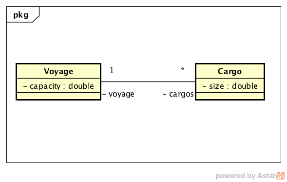
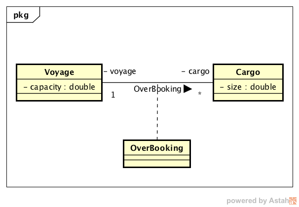
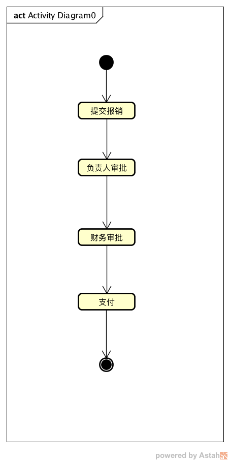

#  OOP面向对象编程

## OOP设计原则

这小结我们会介绍几个面向对象基本的设计原则，这些原则是经过多年众多行业经营总结出来的基础的原则，他们就像物理学家们定义的物理公式一样，它们都如此的简单且优美，但却非常广泛的影响着我们编写的每一行代码。

通常，OOP方式的两种被指责的反模式是：
- 通过类将一种数据格式及其行为进行绑定，从而将状态封装在其内部进行维护是一种将问题隐藏起来而不是解决问题，因为可变状态会带来副作用。
- 面向对象偏向设计一个合理的类之间的继承关系来达到最大限度的代码重用和多态化，但是继承并不是最好的实现多态及代码高可重用的方式。

OOP通过SOLID和DDD这两大原则来解决上面的问题，SOLID中的每个字母都是一个原则的首字母,而DDD则是领域驱动设计(Domain-driven Design)的缩写，我们下面来一一向大家介绍。

### SOLID

SOLID包括如下五个原则

- 单一职责原则 （Single Responsibility Principle, SRP）
- 开闭原则 （The Open/Close Principle, OCP）
- 可被替换原则 （Liskov Substitution Principle, LSP）
- 接口分离原则 （Interface Segregation Principle, ISP)
- 依赖反转原则 （Dependency Inversion Principle, DIP)

这五个原则指导着我们设计的每一个接口，类以及我们如何对现有代码进行持续重构优化，从而达到最佳的代码可伸缩，可测试以及高可复用等目标。

#### 单一职责原则 （SRP）

单一原则要求每一个类都应该有唯一且明确的职责定义，对其职责的改变需要有明确的原因。

这个原则的定义是为了避免定义一个粗线条的超大类并负责多种角色的反模式，设想你刚加入一个公司接管一个项目，如果你没能对其代码完全掌控，那么原因是什么？很可能就是其中几个几千行的类。到你离开或者这个产品被放弃，可能这些类都无法被重构优化，只要这些怪兽类存在问题，我们就必须拼尽体力去不断查日志并加断点调试，猜问题可能出现在哪里。

形成超大类可能有很多原因，一个核心的问题在于OOP将数据结构以及行为封装在一起，问题在于这样对数据接口及其行为的封装不仅仅弱化了组合、聚合在代码灵活可复用的作用，并且将问题隐藏在其内部。最终结果是面向对象代码中经常包括很多数据结构类并带有非常多的方法。

有的项目里会有很多叫Service、Manager、Helper的类，除非团队大家对这些类的角色、职责有非常明确且一致的定义，否则这些类极有可能会生长为巨兽级别的类，因为似乎什么方法都可以放到里面，本来Manager就是应该做很多事情的么。

#### 开闭原则 （OCP）

开闭的意思是对外开放扩展性，而封闭变化，开闭原则就是指我们设计的类应允许外部可以容易的对其进行扩展，同时对类自身的改动也不会影响到外部的其他类，反之外部类的任何改动也不应该影响到这个类的内部。

对已有的类的改动应该仅仅因为这个类自身的bug或者因为需求的改变对其做的调整，这个OCP中的封闭原则。开放的概念则是允许以重用代码的目的对一个类进行继承，或者以注入接口实现的方式对类本身进行扩展。然而通过以继承的形式实现代码重用往往会增加其实现的复杂度，因为很多时候要想确保一个类的方法可以安全的被重载需要基类在设计时考虑更多的因素，尤其是对状态的控制，想想面向对象编程的思路是允许代码以命令行的方式运行，通过代码更改可变量从而实现用状态控制对象行为。我们稍后介绍的LSP原则对继承。

这个思想其实可以延伸一下，当我们设计的不仅仅是一个类而是一个组件，open／close 原则同样也是需要被考虑的，组件需要对外提供必要的接口隔离自身的变化并尽量确保接口的向下兼容性，而对外提供良好的可扩展性同样需要定义清晰的接口供外部实现并注入回组件实现扩展型。有一个比较简单的原则就是组件的扩展性应该一视同仁，即自己如何扩展这个功能，那么外界也应该可以用相同的方式实现同样的功能。例如实现一个主题导航组件，那么导航组件自己提供的默认导航项的实现和创建方式，应该与业务逻辑添加其它导航项的方式保持一致。这个原则将避免组件自己有上帝模式，或者是自己的个性使之可以尽可能多的满足更多的需求，且这个一致性就像是乐高玩具一样，由有限种类的零件可以灵活组合出无限中可能。

#### 可被替换原则 （LSP）

可被替换原则指程序中的任何一个对象应该可以被任何一个自身的子类的对象替换而不会影响整个程序的稳定性和正确性。即子类应尽量保证仅对基类进行扩展，而避免改变父类方法的行为（如果一个方法父类返回true，则同样的上下文下子类的相同方法应该也为true）。遵守LSP原则是为了让我们避免破坏基类的封装性的前提下重用现有代码。

Kotlin语言默认所有方法和属性不可以被重载的目的就是确保所有的重载行为都需要是被设计的，在设计类的时候就应该充分考虑哪些方法可以被安全的重载。要求这样的原因就是要确保LSP原则。要做到这点需要保证父类对外支持的能力其子类必须同样满足，子类不能有任何的假设，子类必须接受所有父类声明接受的属性，并初始化自己及基类的状态。而这些原则是无法通过语法和静态检测来保证的，必须是在设计环节被考虑进来。

#### 接口分离原则 （ISP）

接口分离原则含义是一组由客户方定义的接口好于一个通用接口，没有地方使用的接口就不应该存在，而基于通用的目将非常多的方法定义在一个接口中会造成一方面，使用此接口的地方其实只会用到一两个方法，另一方面实现这个接口的类也因此要实现这个接口下的所有方法。

本质上ISP是针对接口版本的单一职责原则（SRP）他们都试图解决同样的问题，在面向对象设计中平衡职责划分、组合接口以及合并是非常困难的一件事情，有时一个类或者方法的命名的不够准确和恰当都会打破最优的平衡。

#### 依赖倒转原则 （DIP）

依赖反转原则也被称为面向抽象编程，即不要依赖具体的某一个实现编程，而是尽可能的依赖抽象类或者接口进行编程，换种说法就是要依赖抽象模型和接口进行编程。举个最简单的例子，假如我们的组件仅仅需要从Person对象获得name的值，就仅仅对Person类编程，不要针对其子类Customer和Employee（Person抽象类的更具体的实现），而如果我们开发的是员工系统而必须使用Employee模块，则仅仅在有必要的情况下针对Employee进行编程，例如需要从Employee对象中获取工号。

之所以叫依赖倒转的含义是将子类实现看作基类来用，对象实际上是实现层的类被转换成抽象层的类来使用被比喻称为一种反转。

上面的DIP是面向对象设计中的依赖反转原则。而在程序运行期，对象和对象之间的依赖关系的建立同样存在一种依赖反转的原则依赖控制反转，是一个同样非常重要的原则，并且两个依赖反转的原则相互配合起来会给整个程序的可扩展性，可配置性和可测试性能力进行加成。而依赖控制反转指的是一个类对另外一个类的依赖不用他们两者之间决定，可以简单的理解为，A类如果需要一个B类的实例，则不在A类内部构造这个B类，而是仅仅声明一个属性或者在构造函数中声明一个B类的入参，由外部第三方组建负责构造A和B两个类并将B赋值给A对象，即完成依赖关系控制的反转，由内部反转到外部。而结合DIP运用的效果是，定义一个接口InterfaceB由B类来实现，这样A类内甚至都不会出现B类，仅仅针对InterfaceB进行编程，则A类根本不知道有B类的存在，却可以相互协作完成任务。而这个时候倘若想切换InterfaceB的实现为C类，我们只需要从外部构造C类作为InterfaceB给到A类就可以了，无需修改A类的任何代码，这也是一个符合开闭原则的实现，即开放扩展能力且隔离封闭变更。

抽象工厂以及依赖反转容器（IOC）都是精心设计的可以辅助我们完成两个依赖反转原则的好帮手。这里不得不说Spring Framework中的核心组建IOC，是一个历史悠久且非常强大的IOC容器，当然IOC容器不止Spring Framework有，我之前也使用ObjectC语言开发了IOC容器帮助IOS的项目实现组建化和接口注入工作。

## 领域驱动设计 （DDD）

领域驱动模型是一种通过对特定领域知识进行抽象建模，并开发专门的引擎驱动模型实现需求的方式。通过关注特定的领域从而确定需要解决的问题的边界，我们可以对其建模。建模的过程就是对领域中的需求进行抽象从而提炼出名词实体以及术语，使得我们可以不断的使用有限的名词实体和术语的组合出产出无尽的表达能力丰富灵活的业务模型。

领域广义上解释就是对特定的独立的问题划定的一个范围，一个领域通常都有清晰的边界即上下文，定义的模型可以很好的通过有限的元素（实体，数据接口，术语，策略，规则）不断的组合来描述边界内的所有需求以及方案。

领域模型中的概念:

- 上下文（Context）通常同一个词汇运用在不同的地方（模型）会有不同的含义，因此模型中的元素都带有一个上下文，上下文描述当一个词汇出现在某处的时候其含义被确定为某个具体的含义。
- 领域 （Domain）一个特定且独立的实体、环节或者模块。领域是可以被定义出来的主题明确且独立的范围，领域划分的界限代表模型所要概括的知识以及系统的职责的边界。
- 模型 （Model）一个由抽象化的有限元素和术语组成的子系统，用于描述特定领域中的概念并且可以通过不断的组合解决领域内的实际问题。
- 通用语言（Ubiquitous language）通用语言是一种围绕特定领域结构化的沟通语言，一种可以被项目团队中所有成员使用的沟通语言。

使用领域驱动设计的方式可以使得整个项目成员优先关注最最重要和核心的领域和领域中的逻辑，而基于优化后的模型进行复杂设计有助于在实现复杂多变的业务逻辑的同时使得整体实现更加有序，用于描述领域模型的通用语言又同时提高了团队沟通效率（效率包括速度以及准确度）。我们既可以把领域模型理解为设计文档，同时一个可以被引擎解析并驱动的模型又是我们产品的一部分，这使得我们以最直接的方式将设计转化为了代码，或者说两者在领域模型中是合一的。

领域不仅仅来源于用户的直接需求，即使你专门研究过领域驱动设计，但其实你已经在运用它了只是你没有意识到，因为很多领域模型都是面对开发的，例如UML模型就是面向对象设计领域的领域模型，状态机模型则是状态控制的领域模型。我们下面介绍一些与我们平时开发相关的领域模型，领域相关的框架，并介绍Kotlin语言在DDD开发中发挥的作用（DSL）。

### UML模型

UML模型面对的领域是面向对象设计，基于有限的元素类、接口、组件，用例，角色，实例，以及有限的术语继承、实现、引用、组合、聚合等概念对基于面向对象思想设计进行建模，通过不断的组合这些元素我们可以定义出类图、时序图、组件图、通信图、发布拓扑图、状态机图、活动图等，这些设计图最终成为一种通用的语言来完成对OOP设计的描述使得我们可以相互间将设计思想进行高效准确的沟通和交流，并最终将产生的知识固化下来，辅助我们理解和实现我们的代码。

UML模型包括定义一组标准的图元与上面的元素以及概念一一对象来绘制设计图，使用通用的语言对模型进行描述，并且专著于解决具像化图形化设计这一领域。

尤其是在一个项目或者一个模块的设计初期，我们需要进行大量的交流的时候，使用UML图来消除奇异并缺明确方案就显得尤为重要。有的时候，两个人虽然已经进行了非常频繁的口头交流，并切相互表示完全理解明白对方说的意思以及达成共识，但是最后发现开发的代码其实根本不是对方认为的样子。很好的运用UML模型来表达你的设计，可以让我们仅仅通过初期的设计就能确定我们最终开发的代码会是什么样子，到底有哪些接口，哪些组件以及他们的依赖关系和生命周期维护等信息。

下面我们用类图来描述一个使用策略模式定义的一个业务模型，这里也体现了使用领域驱动设计代码的一个好处，就是领域模型具有将隐藏概念和知识清晰化的优势。

我们介绍一个简单的例子使用UML来表达我们的设计，并尝试进行领域模型的抽取。我们从一个简单的领域模型设计开始，基于此模型的系统用来预定一艘船在一次航程中要运载的货物如图：

我们规定这个应用程序的任务是将每件货物（Cargo）与一次航程（Voyage）关联起来，记录并跟踪这种关系，目前看非常简单，但是实际的需求中还有些隐含的概念。例如我们最终的代码中很可能会有一些这样的逻辑：

<pre><code>
fun Int makeBooking(cargo: Cargo, voyage: Voyage): Int {
    val confirmation = orderConfirmationSequence.next()
    voyage.addCargo(cargo, confirmation)
    return confirmation
}
</code></pre>

由于总会有人在最后一刻取消订单，因此航运业的一般做法是接受比其运载能力多一些的货物。这被称作“超订”。一种方式是使用一个简单的百分比来表示允许超订的范围，如允许预订110%的载货量。而有时则会采用更佳复杂的规则（主要客户或特定种类的货物优先）。

这是航运领域的一个基本策略，从事航运业的业务人员都知道这个知识点，但在软件团队中可能不是所有技术人员都知道这条规则。需求文档中对其描述可能仅仅只有语句：允许10%的超订。我们很容易就会忽略这个超订的概念并切无法意识到，这个超订并不与10%这个规则等同，即10%的超订只是超订的一种规则或者是策略。

现在我们就应该修改我们的类图和代码如下：

<pre><code>

data class Voyage(var capacity: Double)

data class Cargo(val size)

fun Int makeBooking(cargo: Cargo, voyage: Voyage): Int {
    val maxBooking = voyage.capacity * 1.1
    if ((voyage.bookedCargoSize() + cargo.size) > maxBooking) {
        return -1
    }
    val confirmation = orderConfirmationSequence.next()
    voyage.addCargo(cargo, confirmation)
    return confirmation
}
</code></pre>

现在一个重要的业务规则被隐藏在了上面这段方法的代码的一个卫语句中，隐藏的还不仅仅是这些，就连10%这个信息都被隐藏在了1.1这个硬编码的数字中，同时这个超订的额度也无法进行更改，必须通过对代码的修改才可以变更。设想我们虽然将系统交付给了最终用户，但是当用户想调整超订范围的时候会有多么的无奈，用户必须找到我们重新修改代码并编译才可以进行调整。如果业务规则被隐藏在这段代码中，业务专家不可能通过检查代码来检测规则是否正确，即是在开发人员帮助下也无法完成，因为它非常隐蔽。同时非业务的技术人员也很难将需求文档与代码进行联系。因此我们这里要考虑如何把这条规则转移到领域对象中，并让项目中的每个人都能清楚并理解它。

我们可以改变一下设计来更好的捕获这个知识，我们将超订这个概念定义为一个策略。策略（policy）其实就是设计模式中的策略模式（Strategy）。

<pre><code>
fun makeBooking(cargo: Cargo, voyage: Voyage, policy: OverbookingPolicy) {
    if (!policy.isallowed(cargo, voyage)) return -1
    val confirmation = orderConfirmationSequence.next()
    yoyage.addCargo(cargo, confirmation)
    return confirmation
}
</code></pre>

这里我们由领域模型驱动设计，将超订这个需求提炼成为策略元素，并定义抽象层OverbookingPolicy类来对应超订这个知识，只要任何实现了isallowed方法的子类都可以作为规则应用到程序中从而实现了可配置和扩展的能力。

现在所有人都清楚超订是一个独特的策略，而且超订规则的实现即明确而又独立。而UML图则充分的从面相对象设计的角度表达了我们的想法。

### 业务流程模型 （Business Process Model）

业务流程模型是针对于企业的流程类需求定义的一种领域模型，通过将流程进行抽象，模型化定义流程，并开发专用的流程引擎负责解析执行。领域模型定义了（Activity）、任务（Task）、路径（Transaction）、路由节点（Router）等元素，所有的流程模型都可以由上面的这些元素组合连接起来形成一个业务流程。

最典型的业务流程就是报销流程，用户创建一个报销工单，通过员工的负责人审批，财务审批、以及最后的支付环节来完成整个报销流程。当一个环节结束后，下一个环节的处理人就会产生一个代办任务。

最简单的流程图如下：

与领域模型对应的UML设计图如下：

