## 开发环境准备

Kotlin 为开发人员提供了语言级别的全栈开发方案，本章将一步一步地学习 setup、编译器环境、IDEA、Android Studio，并分别实现 Web 端，Android，JVM 和 Native 端的 ‘hello kotlin’ 程序。

### 编译环境

Kotlin 支持 REPL，交互式运行环境，安装 Kotlin SDK 后就可以启动命令行窗口，输入 kotlinc-jvm，就可以启动。

#### 手动安装

开发人员可以从 GitHub 上下载最新版本的 Kotlin 的独立运行版本。最新的版本可以从下面的链接中下载。

https://github.com/JetBrains/kotlin/releases/tag/v1.1.3-2

下载 kotlin-compiler-1.1.3-2.zip 后，解压缩后，可以通过设置系统 path 路径到 bin 目录，这样就可以在代码目录下运行编译命令来编译代码，或者输入  kotlinc-jvm 启动 REPL 模式.

**注意：启动 REPL 环境前确保安装了最新版本的虚拟机，虽然 Kotlin 可以运行在 1.6 Java 环境下，但是 REPL 模式，要求本地安装最新版本的 Java 虚拟机。**

leo$ kotlinc-jvm

Welcome to Kotlin version 1.1.3-2 (JRE 1.8.0_131-b11)

Type :help for help, :quit for quit

&gt;&gt;&gt; 

#### SDKMAN! 安装

在 UNIX based 系统中，例如 OS X、Linux、Cygwin、FreeBSD 下，使用 SDKMAN! 会很方便。如果还没有安装 SDKMAN!，可以在命令行窗口下使用下面的命令来安装 SDKMAN!

$ curl -s https://get.sdkman.io | bash

然后，重新打开一个命令行窗口，输入下面的命令，就可以完成安装了。

$ sdk install kotlin

#### HomeBrew 安装

如果开发机器是 Mac 电脑，运行 OS X 系统，可以通过 HomeBrew 安装。

$ brew update
$ brew install kotlin

#### MacPorts

Mac 下也可以使用下面的命令安装：

$ sudo port install kotlin

### 编写第一个 Kotlin 应用

1. 首先可以用任何文本编辑器来创建源代码文件 hello.kt。

<pre><code>
fun main(args: Array&lt;String&gt;) {
    println("Hello, Kotlin!")
}
</code></pre>

2. 使用 Kotlin 编译器编译

$ kotlinc hello.kt -include-runtime -d hello.jar

-d 选项制定输出的编译后的文件的名字，不仅可以指定输出 jar 包，也可以指定目录输出 class 文件。-include-runtime 选项指定输出的 jar 包可以独立运行且包含运行时的所有资源，包括 Kotlin 运行时库。

3. 运行第一个应用

$ java -jar hello.jar 
Hello, Kotlin!

这样第一个 Kotlin 程序就完成了。

### 运行 REPL

REPL 的编程体验，使得开发人员可以通过不断地纠错，调整，然后验证的方式来逼近最终的目标。我第一次接触 REPL 环境实际上是 LISP 和 Python，开始的时候，仅仅把它们当作一个游戏过程，或者是简单逻辑的测试。但是，慢慢地发现，一旦开始了，就无法停下，很多程序从前都会封装成命令行应用或者守护进程模式运行，现在，我的很多程序或者脚本都没有 main 函数。同时当你慢慢地习惯编写函数式的代码时就会发现，你的代码已经形成了一套自己的函数库，可以让你像写文章一样的写出一行功能强大的语句来完成工作。

$ kotlinc-jvm
Welcome to Kotlin version 1.1.3-2 (JRE 1.8.0_131-b11)

Type :help for help, :quit for quit

&gt;&gt;&gt; 2+2

&gt;&gt;&gt; 4

&gt;&gt;&gt; println("Hello Kotlin")

Hello Kotlin

&gt;&gt;&gt;

&gt;&gt;&gt; println("Hello Kotlin")

Hello Kotlin

&gt;&gt;&gt;

&gt;&gt;&gt; fun sayHello(str: String) {

...     println(str)

... }

&gt;&gt;&gt; 

&gt;&gt;&gt; sayHello("Hello Kotlin")

Hello Kotlin

在 REPL 环境下，可以直接输入表达式按回车键来执行，也可以定义自己的函数和类。同样也可以导入已经写好的其他的资源。

### 命令行运行 Kotlin 脚本

和 Groovy 语言一样，Kotlin 也可以支持脚本模式，开发人员可以编写 Kotlin 脚本，Kotlin 的脚本扩展名为 .kts。 

<pre><code>
import java.io.File

val folders = File(args[0]).listFiles { file -> file.isDirectory() }
folders?.forEach { folder -> println(folder) }
</code></pre>

需要使用 -script 选项，编译器会执行编写好的脚本。

$ kotlinc -script list_folders.kts &lt;path_to_folder_to_inspect&gt;

### 在线环境

Kotlin 官方提供在线的运行环境 Kotlin Koans online，Koans 不仅仅是一个在线的 Kotlin 运行时环境，同时也是个很好的教学课件，可以通过这个在线环境逐步熟悉和掌握 Kotlin 这个语言。链接地址为 https://try.kotlinlang.org 。

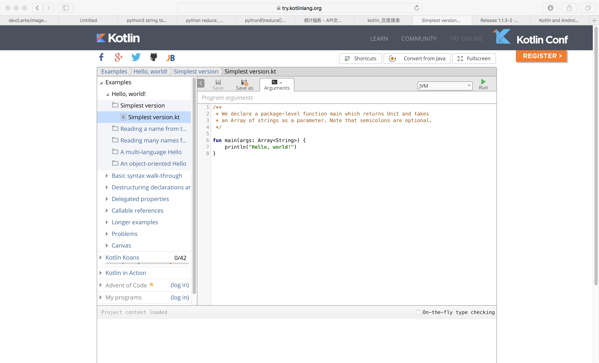

本节上半部分介绍的内容，推荐大家在 REPL、在线环境或者自己编写脚本来验证，这样能第一时间看到介绍的案例活生生的样子。其实生活中有太多的东西都可以用程序来实现，例如，有一个数据，从前是用纸笔记录和计算得出的，当再有同样的需求的时候，请尝试用 Kotlin 实现一个工具来做这样的事情，**记住，工程师永远都不该像计算机那样做重复的工作，该由计算机做的事情，就让它们去做。**

### IDEA

IDEA 是非常出色的开发环境，开发人员可以使用 IDEA 来开发服务器端程序，IDEA 分为社区版本和收费版本，如果仅仅做后台开发，使用社区版本已经足够。但是如果希望开发前端代码，最好使用收费的版本，收费版本会支持代码重复检测、版本控制（Perforce, ClearCase, TFS）、JavaScript、TypeScript。

IDEA 的安装使用过程如下，下载地址是 http://www.jetbrains.com/idea/download 。

1. 下载最新版本的 IDEA 并安装，从 IDEA version 15 以后，Kotlin 开发环境被默认绑定到 IDEA 中，因此，下载后就可以直接开始工作了。
2. 新建一个 project，可以选择 java Module，并添加 Kotlin（Java）然后单击“下一步”按钮。

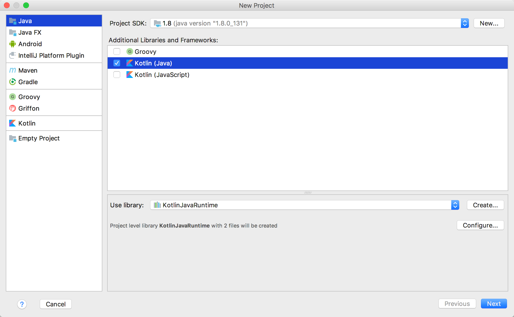

3. 给项目命名

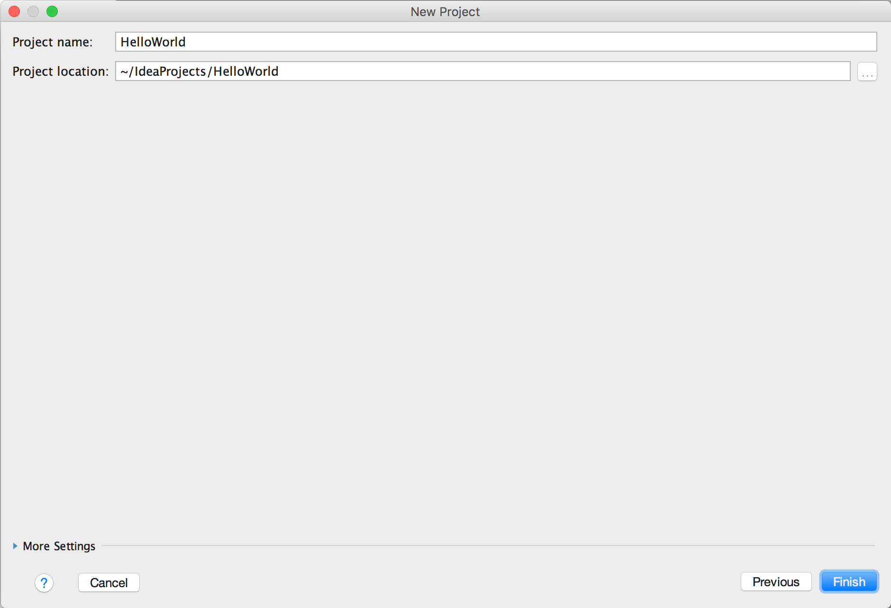

4. 单击“Finish”按钮完成项目创建。

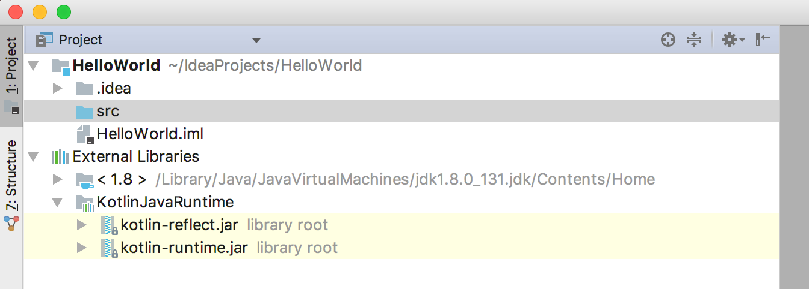

5. 在 src 文件夹下单击鼠标右键打开菜单，New &gt; Kotlin File/Class 创建 app.kt 文件。

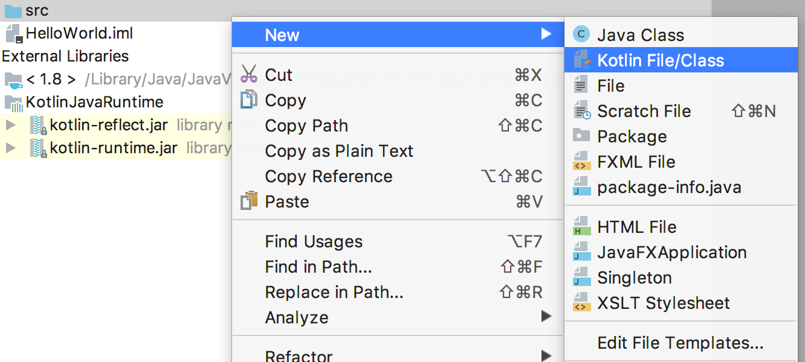

6. 为新创建的 Kotlin class 增加 main 方法和实现。

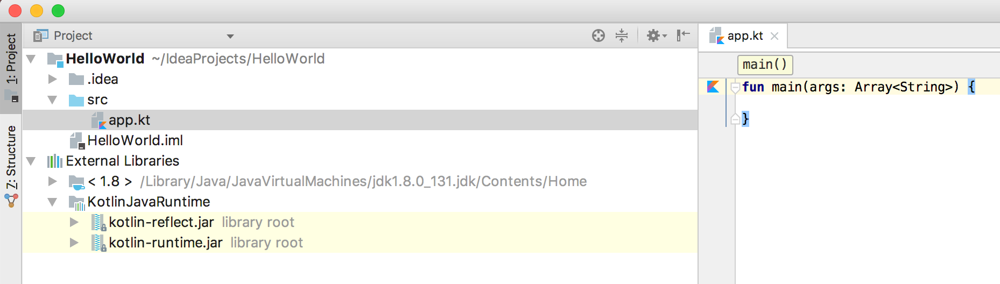
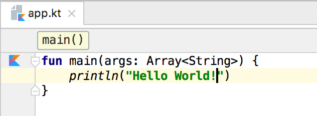

7. 可以通过在代码编辑窗口内单击鼠标右键，选择运行来直接运行

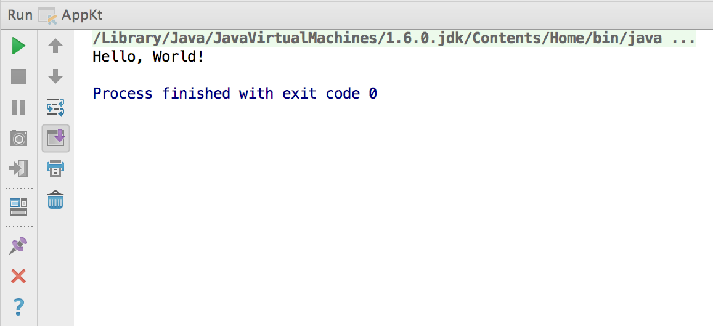

### Android Studio

目前，绑定 Kotlin 插件的 Android Studio 版本是 version 3.0 (https://developer.android.com/studio/preview/index.html), 如果想在更早的Android Studio 进行开发，需要手动安装插件。选择菜单 File | Settings | Plugins | Install JetBrains plugin，搜索 Kotlin，可以跟随引导进行plugin 的安装。

可以从 Android 开发者网站下载支持 Kotlin 开发的 Android Studio 3 版本，目前还是预览版本，但是已经很稳定了。遗憾的是在国内，Android 开发网站需要 VPN 才可以访问，国内也有很多中文镜像网站，可以供我们下载。

1. 启动 Android Studio 后，同样会看到欢迎页面，我们选择创建项目。

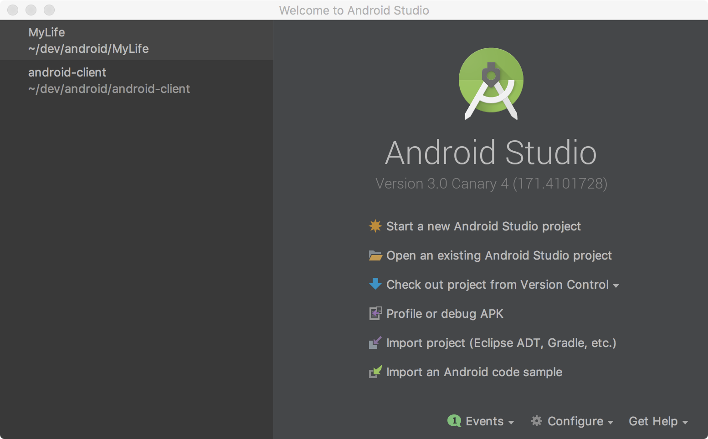

2. 之后，会进入到新建项目的引导流程的第一页，这里需要勾选 Kotlin 支持。

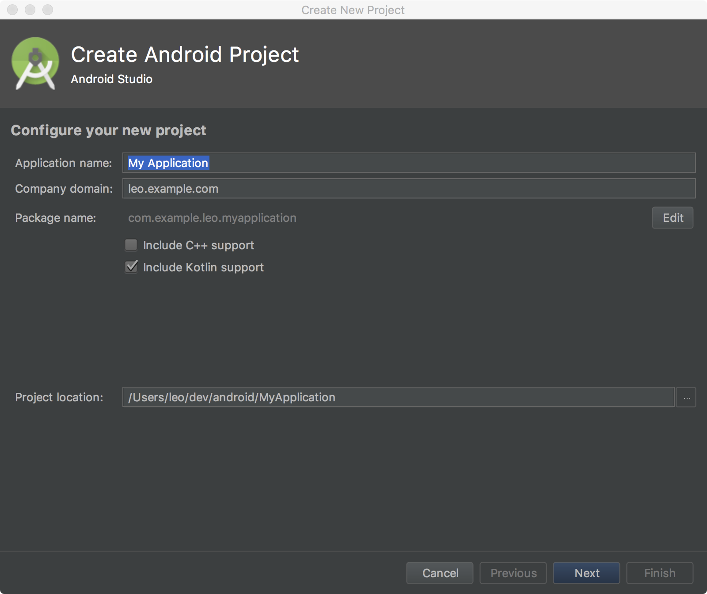

4. 单击"Next"按钮后，会进入 Activity 设置页面，Android 中 Activity 的作用是控制每个独立页面的生命周期，控件事件的处理，因此，一个 Android App需要有一个主 Activity 类。这里可以制定主 Activity 的类名，页面标题，和页面布局文件的名称。

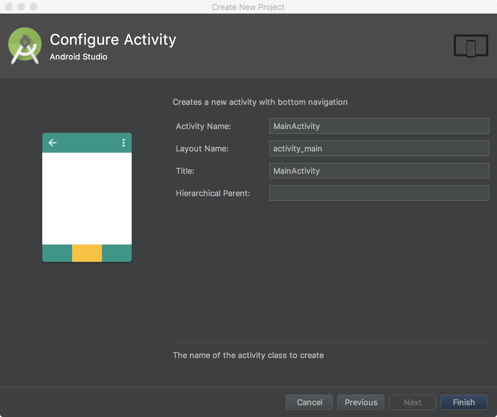

5. 单击“Next”按钮后，最终会进入到引导流程的最后一步，就是指定应用程序的导航模式。可以选择的选项有，单页面应用(Basic Activity)，底部页签导航模式(Bottom Navigation Activity),空白 Activity(空白 Activity 与 Basic Activity 的区别在于，后者顶部导航栏有 menu 菜单),全屏模式（游戏开发）。

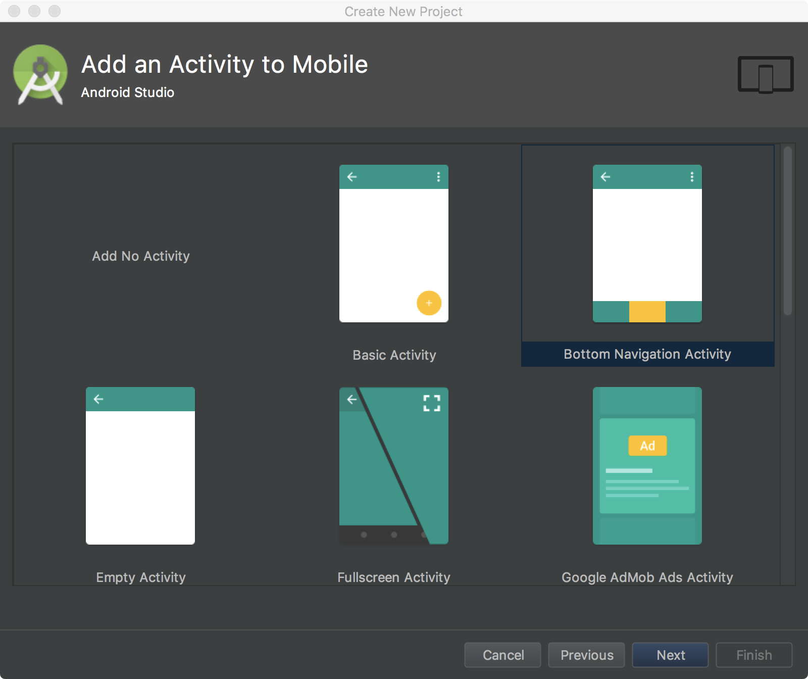

本书会带着大家逐步实现一个实现番茄工作法的应用来让大家掌握如何运用 Kotlin 的特性来优化设计，让我们的产品具备扩展性，可维护行和优雅。因为 Kotlin 可以运行在 JVM，Javascript（Web），Android， 甚至是 iOS 上，因此会在本书中，尝试使用 Kotlin 这一种语言给出这个应用的全部解决方案。包括云端可以保存用户的时间管理数据，客户端可以帮助用户引导用户使用番茄工作法来优化日常的工作，并将数据上传到云端，由云端给出用户的统计数据，和一些建议。并将  Kotlin 的数据持久和通信部分输出成 Native 库，共享给 iOS 客户端也包括 Web 前端。在创作这本书的时候，我也不确定是否可以做到这一点，But, I'm willing to try and find pleasure from it.

