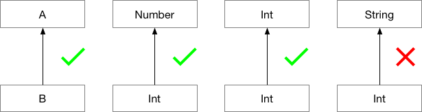
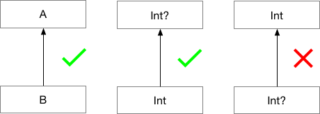

# 类和对象

类和对象是面向对象设计中的最核心的概念，可以把类想象成遗传基因DNA，而把对象想象成为通过类（DNA）创造出来的一个有生命的个体。面向对象设计思想把代码以类为单位进行组织，通过类的继承、对象组合和对象聚合的方式重用代码，通过定义接口和抽象类实现代码可扩展和易维护的目标。

面向对象核心概念：
- 对象 一个对象是运行时被创建在内存中的类的一个实例，通常对象存储在堆内存中。对象有一个关联（分配）的地址保存对象的方法的集合，因此对象是对一个实例状态和行为的封装。创建一个对象需要一个蓝本或规则，面向对象中将这个规则叫做类（Class）这也是为什么把类比作DNA的原因。
- 类 类通过定义一组属性和函数从静态的角度描述一类对象的行为和特征，类是一个用来实现用户定义的类型的结构，例如定义一个叫User的类用于定义一个用户的数据和行为。
- 类成员变量 一个类可以定义0到多个成员变量，成员变量的声明包括制定变量的名称、类型以及作用域。对象则在运行时保存成员变量的值，同一个类创建出来的对象都有相同的成员变量，但是每个对象都各自保存不同的值，这些保存的变量的值被称作对象的状态。而成员变量作用域定义为私有同时提供get和set函数供外部访问的变量叫做属性，Kotlin语言中没有成员变量只有属性。
- 类成员方法 成员方法负责描述一个类的行为，通常实现对成员变量的处理行为以及访问。成员方法描述一个对象的功能和行为。
- 继承 继承是一种类与类之间的关系从而可以基于一个父类定义一个新的子类，子类有与夫类相同的成员变量和方法同时可以扩展父类的公有方法。面向对象编程中使用对类的继承的方法来提供代码重用能力。
- 重载 当一个子类想修改部分父类的方法的时候，可以通过重载的方式覆盖父类的方法，或者通过在重载方法内调用super()函数来执行父类的同名方法来实现扩展而不是覆盖。
- 抽象 抽象的含义是对一类具体的实体的逻辑和行为进行泛化提取出上层逻辑，相当于将公共方法通过定义父类进行抽象，例如定义Person就是对Boy和Gril的抽象。面向对象设计中有一个重要的原则是面向抽象编程（面向接口编程），一个对象应该尽量仅仅依赖抽象的上层类的方法和属性进行编程，而不是一个具体的子类。
- 接口 接口是一个供其它类实现的规范，定义了能对外提供的方法，任何声明实现接口的类都必须提供接口规定的方法的实现。调用放可以仅仅针对接口进行编程而不用依赖具体的实现。很多成熟的面相对象框架实现了IOC容器，可以由外部将接口的实现在运行时从外部注入接口的实现来大道依赖控制反转的目的。
注：我们可以把接口想象成一个插座，插座声明可提供电力，只要符合规范的插头都可以插入取电（欧标，国标还是美标）就可以介入并获取电力且不用关心到底是发电厂提供电力还是便携式发电机提供电力，电力源的切换对用电设备是无感知的，因为这个变化被插座这个协议封装隔离了。

下面的类图是关于一个简单的终端数据同步引擎的设计，数据同步引擎支持两种长链接模式与服务器保持数据同步，以及可以使用HTTP协议发送数据，同时业务层可以通过实现DataChannel接口对通信引擎进行扩展，每一种DataChannel的实现同步一类数据，统一注册到引擎管理并调度，同时引擎提供网络通讯接口作为业务层的服务。

图中包括4个接口DataSyncEngine、Connection、DataChannel和DataChannelRouter，其中DataSyncEngineImple类声明实现DataSyncEngine接口，业务逻辑需要依赖DataSyncEngine提供服务。

<pre><code>
//引擎对外只暴露接口，因此业务逻辑可以仅依赖接口进行编译和测试，而且引擎的实现可以有多种动态切换实现扩展能力
val engine:DataSyncEngint = //从IOC容器获得接口的实现

engine.sendData(data: Data)
</code></pre>

DataSyncEngineImpl类有一个叫sessions的Map集合持有一个到多个会话，每个会话代表与服务器的一个业务层链接，当socket或者websocket与服务器建立链接后，session需要负责与服务器进行认证以及维护一个心跳对长链接进行保活，同时当链接中断时调用Connection的connection函数自动重新建立链接。

接口Connection就是上面提到的插座，session仅仅知道自己引用的接口什么时候，如何去调用，但是不会关心connection的实现是Socket还是Websocket。

而Connection的实现类的职责也很简单，就是收发二进制数据、发起链接、终端链接以及统计收发数据流量。

DataChannel接口则是引擎定义出来需要外层去实现的扩展接口，每个DataChannel就是一个虚拟的数据通道，引擎在sesson建立后，出发所有DataChannel开始同步数据确保客户端数据保持最新。

下面的类图是当前所有的DataChannel的实现，分别负责同步IM消息、通讯录、日程以及email。

这样我们就定义好了各自需要实现的接口，由于基于面向抽象（接口）编程，使得团队可以并发共同开而不必相互依赖，我们只需要定义好边界接口，那么小组成员就可以各自开发一个接口，进行单元测试。最后再通过构造工厂或者依赖注入进行集成。这样开发的好处是，清晰定义的接口可以让我们在开发之前就确定大部分需求是否已经被考虑到，且对接口的讨论充分也证明小组成员都对设计充分的理解，这样不管谁负责哪个接口的实现都不是问题，因此可以更加动态的分配工作实现高效的开发。

一个健壮的系统，应该是分层设计的多个健壮的组件进行集成和扩展实现的。每一层的组件都是对下层组件提供的接口的整合并通过提供功能更加强大的接口为其上层服务。

下面我们定义三个Connection接口的实现：

引擎提供三种远程通信能力，Socket、WebSocket和Http。

最有一张图是一张组建图，描述业务逻辑如何通过实现DataChannel并注入到引擎对引擎的能力进行扩展。

Message是一个组件，组件中的某一个类必须实现DataChannel接口，由引擎触发同步，Message组件通过调用DataSyncEngine接口的sendMessage方法发送同步指令或者发送IM Message。

上面的类图只是一个最原始的设计图，实际项目中还需要考虑性能监控、自适应流量控制、多IP并发重连、长链接与短链接智能切换，数据的编解码以及收发队列和线程池等。但是这些所有的功能，都可以通过上面这个设计不断的进行扩展和重构来实现。

在了解了面向对象设计重，我们如何通过合理的定义不同的类、接口以及类之间的继承关系来组织我们的代码高效的完成业务逻辑，下面我们就开始逐步掌握Kotlin重的面向对象。

## 类和继承

### 类

在介绍类之前我们需要从对象开始介绍。
首先要定义术语是时间，指事件发生的相对时刻。有了时间的定义，在某一时刻同对象关联在一起的属性（静态和动态）或者对象的集合会形成一种共生关系（引用），任意时刻，我们都可以得到一个对象属性的快照，这个快照就是对象在当前时刻运行时的一个态，我们通过调用对象的方法来改变对象在下一时刻的态。

而类则是对一种对象的定义，因此类定义包括这种对象有哪些属性、方法和构造函数的一个定义，因此面向对象思维模式采用的方法是吧应用领域定义成一组名词（类），而函数式思维则会通过抽取动词并对动词进行排列组合来提供问题的解（实现）。

面向对象的类有一个能力时多态，这里的太不同于对象中的状态（属性值的快照），而是一种能力，同名的函数或者方法可以根据目标对象类型的不同有不同的定义。

Kotlin 中使用 class 关键字来声明类：

<pre><code>
class Foo {

}
</code></pre>

一个完整的类的声明，包括类的名称，类的头部（包括类的主构造函数，父类声明），紧跟大括号包括的 body。头部和 body 都是可选的。下面是声明一个类的最简单的形式。

<pre><code>
class Empty
</code></pre>

### 构造函数

一个 Kotlin 类只能有一个主构造函数，但可以有一个或者多个辅助构造函数。主构造函数作为类头部的一部分出现。

<pre><code>
class Person constructor(firstName: String) {
}
</code></pre>

如果主构造函数不包括任何代码或者可见的修改器，constructor 关键字可以省略。

<pre><code>
class Person(firstName: String) {
}
</code></pre>

主构造函数不能包含任何代码，初始化代码可以放在专有的初始化代码块中，初始化代码块紧跟在 init 关键字后：

<pre><code>
class Customer(name: String) {
    init {
        logger.info("Customer initialized with value ${name}")
    }
}
</code></pre>

主构造函数声明的参数可以用于初始化init代码块或类内部的属性。

<pre><code>
class Customer(name: String) {
    val customerKey = name.toUpperCase()
}
</code></pre>

Kotlin 类声明的一种最简洁的形式是仅仅只需要有类名和参数。

<pre><code>
class Person(val firstName: String, val lastName: String, var age: Int) {
    // ...
}
</code></pre>
主构造函数内的参数既可以是变量var，也可以是不可变val。

如果构造函数包含注解或者作用域修饰则 constructor 关键字是必需的。作用域修饰要在最前面。

<pre><code>
class Customer public @Inject constructor(name: String) { ... }
</code></pre>

###  辅助构造函数

一个类可以有多个辅助构造函数，在类 body 中使用 constructor 来修饰。

<pre><code>
class Person {
    constructor(parent: Person) {
        parent.children.add(this)
    }
}
</code></pre>

所有的辅助构造函数都必须制定主构造函数为代理，或者可以由其他的已经被自主构造函数代理的辅助构造函数代理。设置代理使用“:”后跟 this(&lt;parameters&gt;) 的形式。

<pre><code>
class Person(val name: String) {
    constructor(name: String, parent: Person) : this(name) { //继承主函数，或者称为做主构造函数的代理构造函数
        parent.children.add(this)
    }
}
</code></pre>

一个没有任何辅助构造函数的非抽象类将默认生成一个没有如参的主构造函数，因此如果想让此类不可以被外部创建。（由类的共有函数来创建）则可以使用下面的方式。

<pre><code>
class DontCreateMe private constructor () {
}
</code></pre>

**注意：如果为 JVM 环境编写程序，需要为主构造函数的参数指定默认值，编译器可以自动生成一个没有参数的构造函数，并为所有参数初始化默认值。这样有助于 Kotlin 类被用在例如 JPA 等一些容器通过无参构造函数，runtime 创建实例的库中。**

<pre><code>
class Customer(val customerName: String = "")
</code></pre>

##  创建对象实例

 可以通过直接调用一个类的构造函数来创建对象，因此，Kotlin 没有 new 关键字。看起来，就像是在调用一个与类同名的函数。

<pre><code>
val invoice = Invoice()
val customer = Customer("Joe Smith")
</code></pre>

### 类的组成

类中包含以下部分：
- 构造函数和初始化代码块
- 函数定义
- 属性
- 匿名类和内部类
- 对象声明

### 继承

继承是面向对象思想中的概念，一个类可以且只可以继承自另一个类。被继承的类称为父类（基类），继承自父类的所有类都称为它的子类。例如：

在面向对象设计中，通过继承方式将逻辑分层，通用的共同的逻辑不断向上层迁移，而底层的具体的需求，向下迁移由子类来承担。（同样的代码永远只存在一份，每当拷贝一处代码到另外一个地方的时候，提醒自己应该有更好的办法。）

后面还会介绍，通过组合和聚合的方式同样可以实现代码的高度重用，同时组合和聚合比继承增加了在runtime时的灵活性，也就是通过组合和聚合可以在运行时调整一个宿主对象的行为和特性。

Kotlin 的所有的类都继承自Any类，不需要声明。因此任何类如果不声明继承关系，则默认继承自Any。

Any类与Java的java.lang.Object不同, Any类只实现equals()、hashCode(）和toString()。

定义类继承关系需要在类的头部使用“:”，后跟父类的名字。

<pre><code>
open class Base(p: Int)

class Derived(p: Int) : Base(p)
</code></pre>

如果子类有主构造函数，则可以像上面的例子中，用主构造函数的参数来初始化基类的构造函数。（参数 p 作为基类构造函数的入参）如果子类没有主构造函数，则辅助构造函数必须使用 super 关键字初始化父类，或者作为其他已经初始化主构造函数的辅助构造函数的代理。这里注意的是，子类可以通过调用父类的主要和次要构造函数来完成父类的初始化，同时，子类的不同次要构造函数可以分别调用父类的不同构造函数。

<pre><code>
class MyView : View {
    constructor(ctx: Context) : super(ctx)

    constructor(ctx: Context, attrs: AttributeSet) : super(ctx, attrs)
}
</code></pre>

上面出现的 open 关键字相当于 Java 中的 final 的反作用。因为在 Kotlin 语言中，所有的类都是 final 类型的，只有 open 类型的类才可以被继承。这样设计的原因在于，往往开发过程中，很难将开发的每一个类都设计的适合被继承，在 Java 中，经常是有很多函数，一旦被子类覆盖实现，就会彻底崩溃掉。因此 Kotlin 则采用严谨的态度，只有设计中允许被重载的函数或者基类，才可以通过使用 open 关键字来开放，否则，就允许继承和重载。

### 方法重载
重载的意思是子类可以重新定义夫类中的同名方法的行为，可以完全覆盖夫类方法的行为，子类的重载方法可以通过调用supper函数来调用夫类同名方法对其进行扩展而不是覆盖。

Kotlin需要明确的使用override来声明对父类的open类型的函数进行重载，所有方法默认都是不可以被重载的，必须手动时用open关键字才能允许子类重载。Kotlin语言的观点是，所有的重载都是设计的时候确定允许被重载的，因此与Java相反，默认所有方法都是不可被重载的。

<pre><code>
open class Base {
    open fun v() {}
    fun nv() {}
}

class Derived() : Base() {
    override fun v() {} //必须使用override关键字，否则编译器会警告
}
</code></pre>

没有open修饰的函数，子类即使使用了override也是不合法的，编译会失败。如果类头部未使用open修饰，则函数也不允许为open类型。

添加了override的方法，本身是可以被它的子类重载的，如果想禁止，则需要增加final关键字。

<pre><code>
open class AnotherDerived() : Base() {
    final override fun v() {}
}
</code></pre>

### 属性重载

属性重载的方式和方法重载类似，也是通过override声明，且只能重载父类中open类型的属性, 但是可以将不可变变量重载为可变变量，反过来也可以。重载不能改变属性的数据类型，只能重载属性的初始化和get方法。

注意：override关键字可以出现在主构造函数的参数列表中。

<pre><code>
interface Foo {
    val count: Int
}

class Bar1(override val count: Int) : Foo

class Bar2 : Foo {
    override var count: Int = 0 //在此增加属性默认值，以及将不可变属性重载为可变属性。
}
</code></pre>

### 重载规则

Kotlin中重载有一个需要遵守的规则，如果一个类的上层存在同一个方法的多个实现的话（例如，父类和接口扩展都实现了同一个方法），则子类必须重载此方法并提供自己的实现。这时Java面向对象中不可能出现的情况。一种简单的方式是，在子类的实现中，通过 super&lt;type&gt; 这个关键字来

<pre><code>
open class A {
    open fun f() { print("A") }
    fun a() { print("a") }
}
interface B {
    //后面会讲到，Kotlin 中接口可以提供默认的实现，着类似 Swift 中的扩展，因此可以不通过集成，直接通过扩展的方式，为任何类增加新的方法。即能力。
    fun f() { print("B") } // 接口中的方法默认是 open 类型的
    fun b() { print("b") }
}
class C() : A(), B {
    // 因为这个类的父类和接口中都实现了这个方法，因此，即使没打算在子类从载，编译器也需要我们提供一个明确的实现来避免歧义。
    // 这里，我们可以简单的通过
    override fun f() {
        super&lt;A&gt;.f() // call to A.f()
        super&lt;B&gt;.f() // call to B.f()
    }
}
</code></pre>

## 抽象类

抽象类与普通的类的区别在于，抽象类中的方法可以没有实现，实际上抽象类是对一类通用逻辑的抽象。因此虽然抽象类也可以有自己的构造函数但却不能被构造出来，就是不存在抽象类构造出来的对象。抽象类中未提供实现的方法被称作抽象方法，不同的子类可以提供相同抽象方法的不同实现。

同Java一样，可以通过abstract来定义抽象类和抽象方法。抽象方法没有具体的实现。且因为抽象函数就是希望被子类实现的，因此不需要使用open修饰，就可以被子类重载。

<pre><code>

open class Base {
    open fun f() {}
}
abstract class Derived : Base() {
    override abstract fun f()
}

</code></pre>

## 伴生对象

因为Kotlin是没有static关键字的，因此类没有静态方法。推荐直接使用package作用域下的函数来代替，如果想通过类名称作为方法的命名空间的话，可以使用伴生对象。

如果想定义一个方法，不通过获得一个类的实例直接调用，但同时又想访问被调用对象的内部。（例如，工厂方法）可以在被调用类内用companion object关键字声明一个内部伴生类，在半生对象内，可以像在 Java 中调用静态方法一样，来调用宿主对象内的方法，只是需要使用宿主的类名作为前缀.

<pre><code>

class MyClass(val text: String) {
    private fun init() {}
    companion object {
        fun newInstance(): MyClass {
            val test = MyClass("Hello")
            test.init()
            return test
        }
    }
}

MyClass.newInstance()
</code></pre>

### 属性和字段（property and fields）

在面向对象设计中，一个类可以具有多种属性，例如，我们创建一个类来代表员工（Staff），每个公司的员工，都有工龄、薪资、入职时间、职位、部门等信息，这些都是一个员工的属性，这些都是Staff类拥有的属性，属性的值保存在每一个对象中，称为对象的状态。

属性为一个类的状态，外部只可以通过getter和setter函数来访问一个类的属性。而字段则是一个类下的变量，外部可以直接访问，不需要通过 getter和setter函数，但是Kotlin不支持字段只有属性。

Kotlin会自动为属性生成getter方法和setter方法，Kotlin程序不需要显示的调用get或者set方法来访问属性，只有Java代码想访问Kotlin中的对象的属性的时候，才需要调用get和set方法。

类可以有多个属性。可以声明成可变属性 var 和不可变 val 两种。

<pre><code>
class Address {
    var name: String = ...
    var street: String = ...
    var city: String = ...
    var state: String? = ...
    var zip: String = ...
}

//Java 
Address address = new Address()
address.set("香榭丽舍大道")

println(address.get()) // 打印  香榭丽舍大道
</code></pre>

在Kotlin中可以通过属性名直接引用一个属性。

<pre><code>
val address = Address()
addres.name = "香榭丽舍大道"

println(address.name) // 打印 香榭丽舍大道

fun copyAddress(address: Address): Address {
    val result = Address() // there's no 'new' keyword in Kotlin
    result.name = address.name // accessors are called
    result.street = address.street
    // ...
    return result
}
</code></pre>

### Getter 和 Setter

声明一个属性的完整语法

<pre><code>
var &lt;propertyName&gt;[: &lt;PropertyType&gt;] [= &lt;property_initializer&gt;]
    [&lt;getter&gt;]
    [&lt;setter&gt;]
</code></pre>

property_initializer、getter、setter都是可选的，如果initializer存在，或者getter提供返回值可以让编译器推断出属性类型，则PropertyType也是可选的。

<pre><code>
var allByDefault: Int? // error: 需要明确的初始值
var initialized = 1 // 定义 Int 类型的变量 initialized，缺省的 getter 和 setter 函数
</code></pre>

不可变属性以val开头，且不允许有setter函数。

<pre><code>
val simple: Int? // Int类型变量simple， 默认的getter函数实现，因为是不可变，因此必须要在类的构造函数中初始化。
val inferredType = 1 // 取值为1的Int类型变量inferredType，默认的get函数实现。
</code></pre>

可以自定义get函数：

<pre><code>
val isEmpty: Boolean
    get() = this.size == 0
</code></pre>

代码中this关键字是对当前类实例的引用。

自定义set函数：

<pre><code>
var stringRepresentation: String
    get() = this.toString()
    set(value) {
        setDataFromString(value) // parses the string and assigns values to other properties
    }
</code></pre>

缺省的set方法为唯一入参是value，大部分时候，直接使用 value 这个名字会很方便，但是，也可以使用一个自定义的的名字来代替 value 这个缺省值。

Kotlin 1.1 以后，可以通过自定义get函数的返回类型来指定属性的类型。

<pre><code>
val isEmpty get() = this.size == 0 // has type Boolean
</code></pre>

如果只想改变属性的作用域或对其进行注解，但不想自定义属性的get和set函数，可以省略函数体：

<pre><code>
var setterVisibility: String = "abc"
    private set // 这里不需要提供setter的body
var setterWithAnnotation: Any? = null
    @Inject set // 后面向大家介绍注解的概念
</code></pre>

辅助字段 （Backing Field）

Kotlin 中的类是不支持字段的。但是，当实现自定义set函数的时候，需要一个辅助字段来访问property，当且仅当在set中才可以使用关键字field来访问property。

<pre><code>
var counter = 0 // value 的值被直接赋值给property，通过使用辅助字段设置属性值
    set(value) {
        if (value >= 0) field = value
    }
</code></pre>

field 关键字仅可以属性的（get和set）中使用。且field被生成的前提条件是属性的get或者set函数至少有一个不被重载，即使用默认实现。

例如，下面这段代码中field不会被生成

<pre><code>
val isEmpty: Boolean
    get() = this.size == 0
</code></pre>

### 辅助属性 (Backing Property)

如果想在get或者set方法中需要进行额外的工作，而这时field无法满足需求的时候，可以使用辅助属性来实现。例如：

<pre><code>
private var _table: Map<String, Int>? = null //辅助属性
public val table: Map<String, Int>
    get() {
        if (_table == null) {
            _table = HashMap() 
        }
        return _table ?: throw AssertionError("table属性被其它线程释放") 
    }
</code></pre>

辅助属性必须是私有的，因此和Java语言中访问私有属性的方式相同，且同样没有默认的get和set函数。对辅助属性的访问，不会产生函数调用。

### 编译时常量

如果在编写代码的时候，一个属性的值就已经被确定，且不会再被改变（例如一些配置属性），则可以声明为编译时常量。可以为属性添加 "const" 来修饰。

编译时常量必须满足以下条件：

- 必须是全局或者属于一个对象
- 类型必须是string或者其他原始类型
- 没有自定义getter函数

编译时常量可以用在注解中（配置属性）

<pre><code>
const val SUBSYSTEM_DEPRECATED: String = "This subsystem is deprecated"
@Deprecated(SUBSYSTEM_DEPRECATED) fun foo() { ... }
</code></pre>

### 延后赋值属性

Kotlin 的属性分为可选属性用“？”注明（optional）和非空属性！号注明，未指定时属性默认都是非空属性。

非空属性必须要在雷的构造函数中初始化，但是有的时候没法在构造函数中赋值，这时如果又想声明成非空属性使得引用这个属性的所有地方省区做判空处理时可以使用lateinit。例如，在对象构造后由依赖注入框架赋值或单元测试中的setup函数中赋值等，可以使用lateinit关键字来告诉编译器，稍后程序会在变量被使用前为此属性赋值。

<pre><code>
public class MyTest {
    lateinit var subject: TestSubject
    @SetUp fun setup() {
        subject = TestSubject()
    }
    @Test fun test() {
        subject.method()
    }
    // dereference directly
}
</code></pre>

注意只有可变属性var才可以使用lateinit。如果在延时赋值属性被初始化之前访问此属性，则会抛出特定的异常来告诉开发者。

## 接口 （Interface）

Kotlin的接口和Java8十分相似,其实跟Swift的protocol更像。接口是面向对象中非常重要的一个概念，纯面向对象中的接口必须全部都是抽象函数，即只有函数的定义没有实现，声明实现此接口的类，必须提供接口中所有抽象函数的实现。Kotlin中的接口与传统的面向对象不同，即可以是抽象函数也可以提供默认实现，即非抽象函数。允许接口定义的方法有默认实现可以使我们不通过泪的集成直接对特定的类进行扩展，也就是声明实现这个接口的类直接可以使用接口的带有默认实现的函数。接口是不可以保存属性的状态，因此不可以在接口中给属性赋值，要么声明抽象属性，要么为属性提供自定义访问函数。

接口使用 interface 关键字来声明:

<pre><code>
interface MyInterface {
    fun bar()
    fun foo() {
        // 函数的实现是可选的。
    }
}
</code></pre>

### 实现接口

一个类可以声明实现一个或者多个接口:

<pre><code>
class Child : MyInterface, MyInterface2 {
    override fun bar() {
        // body
    }
}
</code></pre>

### 接口中的属性

接口中也可以声明属性也可以声明抽象接口定义，或者提供自定义的访问器函数。但是由于接口是无状态的，因此接口中属性的get和set函数中是没有back field的。

<pre><code>
interface MyInterface {
    val prop: Int // abstract
    val propertyWithImplementation: String
    get() = "foo"
    fun foo() {
        print(prop)
    }
}

class Child : MyInterface {
    override val prop: Int = 29
}
</code></pre>

### 作用域标识

类、对象、接口、构造函数、函数、属性和属性的get/set方法都可以用作用域修饰符来指定可见作用域。（Getter 的作用域与属性声明的作用域相同，不可以单独指定）一共有 4 种作用域：私有(private)、保护(protected)、内部(internal) 和 公共(public)。未指名作用域的时候，默认的作用域是 public。

#### 包作用域 (Packages)

函数，属性，类、类的对象和接口都可以被声明在Packages下作为顶层元素。

<pre><code>
// file name: example.kt
package foo

fun baz() {}
class Bar {}

</code></pre>

- 如果在包内的顶层声明的元素，没有指定任何作用域，则都为public作用域，这些元素将全局可见。
- 如果声明私有元素，则元素的作用域仅限于文件内部。
- 如果定义 internal，则此元素仅模块内可见（Kotlin 中 Model 被定义为一组源代码文件被独立的编译并打包到一起）。
- 包的顶层元素不可以使用 protected，因为 protected 主要用户在对象继承关系中，仅子类可见。因此，只在类内部使用。

<pre><code>
// file name: example.kt
package foo

private fun foo() {} // visible inside example.kt

public var bar: Int = 5 // property is visible everywhere
    private set // setter is visible only in example.kt

internal val baz = 6 // visible inside the same module

</code></pre>

#### 类和接口作用域

在类中，可以使用 private、protected、internal 和 public 全部这 4 种修饰。

- private 私有作用域，仅当前类可见。
- protected 仅当前类和其子类可见。
- internal 模块内可见。
- public 对任何类可见。

Java 开发者注意：在 kotlin 中，一个类的内部类中的private元素对其宿主不可见。

<pre><code>
open class Outer {
    private val a = 1
    protected open val b = 2
    internal val c = 3
    val d = 4 // 默认为public

    protected class Nested {
        public val e: Int = 5
    }
}

class Subclass : Outer() {
    // a 不可见
    // b, c 和 d 可见
    // Nested 和 e 可见

    override val b = 5 // 'b' 保护级别
}

class Unrelated(o: Outer) {
    // o.a, o.b 不可见
    // o.c 和 o.d 可见 (同模块下)
    // Outer.Nested 不可见, 同时Nested::e 不可见
}
</code></pre>

#### 构造函数

通过在constructor关键字前指定作用域：

<pre><code>
class C private constructor(a: Int) { ... }
</code></pre>

未设置作用域时，主构造函数默认为public，有时如果一个类仅做工具类或者想确保全局仅有一个实例时，可以将构造函数私有化来禁止外面构造这个对象。

#### 模块

上面提过关键字 internal 作用域代表被修饰的元素尽在模块内可见。而一个模块为代码文件的集合，例如：
- Intellig IDEA module
- Maven 或者 gradle 的项目
- 或者是一个 ant task 打包的 jar

##扩展（Extensions）

和 C#、Swift 相似，Kotlin 可以在不需要继承基类的情况下直接对类进行扩展。Kotlin可以实现函数扩展和属性扩展。尤其是在无法修改依赖的模块内的对象的时候可以在自己的模块中对第三方类进行扩展，可以在Kotlin语言中通过扩展来实现。

### 函数扩展

声明对函数的扩展，只需要在扩展函数的名字前面使用被扩展类的名字作为前缀，并用“.”来分割。下面的例子将函数 swap 扩展到 MutableList&lt;Int&gt;:

<pre><code>
fun MutableList&lt;Int&gt;.swap(index1: Int, index2: Int) {
    val tmp = this[index1] // 'this' corresponds to the list
    this[index1] = this[index2]
    this[index2] = tmp
}
</code></pre>

扩展函数内使用this应用被扩展的类，现在为MutableList扩展了一个函数swap，可以调用这个扩展函数。

<pre><code>
val l = mutableListOf(1, 2, 3)
l.swap(0, 2) // 'this' inside 'swap()' will hold the value of 'l'
</code></pre>

上面函数中用到了范型（generic）将会在后面详细介绍。MutableList本身是个通用容器，函数扩展也可以同样用在范型中，例如上面的函数扩展可以改写为：

<pre><code>
fun &lt;T&gt; MutableList&lt;T&gt;.swap(index1: Int, index2: Int) {
    val tmp = this[index1] // 'this' corresponds to the list
    this[index1] = this[index2]
    this[index2] = tmp
}
</code></pre>

注意两个swap方法的区别在于.swap之前的&lt;...&gt;中的内容，一个是具体的Int类型，而后者则是泛型中的类型符号。

### 扩展的静态确定

扩展函数对类的扩展是静态时确定的，即编译时，一方面扩展函数并不是被添加到类上的，同时也不是动态的为类增加了虚拟的函数。Kotlin仅仅通过增加了一个函数，并使这个函数可以通过变量调用到而已。

由于扩展是静态确定的，因此没有办法通过运行时根据对象的实际类型来切换调用的具体函数的实现，只能在编写代码时，通过代码中的对象的类型来确定调用哪个具体的扩展函数。就是说，子类扩展是不能重载基类的扩展函数的，如果代码里声明的是基类类型的变量，则只能调用到对基类的扩展函数。因此，不建议滥用这个便利，仅当组件内想多依赖的外部接口或者类进行能力扩充的时候使用。

<pre><code>
open class C

class D: C()

fun C.foo() = "c"

fun D.foo() = "d"

fun printFoo(c: C) { // 由于入参确定了类型为C， 因此即使我们传入的实际上是子类，只有C 类的扩展函数会被调用。
    println(c.foo())
}

printFoo(D()) // 输出 "c"
</code></pre>

最终结果是输出 c，因为目标扩展函数是通过入参c的声明类型来确定的，变量c的类型是C，因此对C的扩展函数C.foo()将会被调用。

成员方法优先级高于扩展方法，如果类内成员函数已经有同名和相同入参的话，外部的同名相同入参的扩展函数会不起作用。例如：

<pre><code>
class C {
    fun foo() { println("member") }
}

fun C.foo() { println("extension") }
var c = C()
print(c.foo())
</code></pre>

输出结果为"member"

如果仅仅是名字相同，入参签名不同，则扩展函数可以起作用。

<pre><code>
class C {
    fun foo() { println("member") }
}
fun C.foo(i: Int) { println("extension") }

C().foo(1) //will print extension
</code></pre>

### 被扩展类可空

扩展函数可以使用 ？ 标识声明被扩展对象（receiver）为可空类型，代表被扩展的对象本身有可能为空，可以使用 ？ 标识修饰扩展函数，并在函数内对 this 进行非空判断。

下面的扩展允许开发人员放心的对任何对象变量调用 toString() 函数，不管变量是否为空。

<pre><code>
fun Any?.toString(): String {
    if (this == null) return "null"

    // after the null check, 'this' is autocast to a non-null type, so the toString() below
    // resolves to the member function of the Any class
    return toString()
}
</code></pre>

### 扩展属性

扩展属性和扩展函数非常相似：

<pre><code>
val <T> List<T>.lastIndex: Int
    get() = size - 1
</code></pre>

因为扩展机制是静态时建立的，实际上扩展属性并不在类内部，编译器会为扩展属性生成新的对象并与被扩展对象梆定，因此扩展属性是没有办法有辅助字段的，因此构造函数内不可以使用扩展属性。

### 扩展的范围

通常直接在package下面定义扩展。

<pre><code>
package foo.bar

fun Baz.goo() { ... }
</code></pre>

如果想在包内使用包之外的扩展来扩展包内部的类，只需要对其进行导入，使用关键字 import。

<pre><code>
package com.example.usage

import foo.bar.goo // 导入foo.bar.goo 包下的所有扩展

// 或者

import foo.bar.* // 从 "foo.bar" 导入所有元素，包括扩展，类，函数 

fun usage(baz: Baz) {
    baz.goo()
)
</code></pre>

### 类内定义扩展

可以在类内部定义对外部类的扩展，在扩展函数内可以访问到类本身的所有对象成员和函数，就像这个类里的其他成员函数一样。

<pre><code>
class D {
    fun bar() { ... }
}

class C {
    fun baz() { ... }
    fun D.foo() {
        bar() // calls D.bar
        baz() // calls C.baz
    }
    fun caller(d: D) {
        d.foo() // call the extension function
    }
}
</code></pre>

如果在一个类内部对外部类的方法进行扩展，当调用的方法在两个类中都存在是，会产生冲突，这时默认会调用被扩展的类的方法，如果需要调用的是进行扩展的类中的方法，需要使用this@加类名称进行指定。

<pre><code>
class C {
    fun D.foo() {
        toString() // 调用 D.toString()
        this@C.toString() // 调用 C.toString()
    }
}
</code></pre>

类内部的扩展方法可以是open作用域的，且可以被子类重写。相当于类中的成员扩展方法的实现取决于构造的是哪个类，父类还是某个子类，但是对被扩展对象来说，其扩展函数的实现依然在静态时被确定。

<pre><code>
open class D {
}

classlass D1 : D() {
}

open class C {
    open fun D.foo() {
        println("D.foo in C")
    }

    open fun D1.foo() {
        println("D1.foo in C")
    }

    fun caller(d: D) {
        d.foo() // 静态时确定实现
    }
}

class C1 : C() {

    override fun D.foo() {
        println("D.foo in C1")
    }

    override fun D1.foo() {
        println("D1.foo in C1")
    }

}

C().caller(D()) // prints "D.foo in C"
C1().caller(D()) // prints "D.foo in C1" - caller函数静态确定调用D的扩展函数 foo() ,同时foo() 的实现被C1 类重写
C().caller(D1()) // prints "D.foo in C" - caller函数静态时去定调用对D的扩展函数 C.foo() 的扩展
</code></pre>

### 使用扩展的动机

在Java语言中有时候会创建带有Utils后缀的类，用于放一些公共的无状态的静态工具函数。例如Java中非常著名的集合工具类java.util.Collections中提供了一些工具函数来方便处理数据集。

<pre><code>
// Java
Collections.swap(list, Collections.binarySearch(list, Collections.max(otherList)), Collections.max(list))
</code></pre>

使用Java静态导入这个类（Kotlin 没有静态导入的概念），曾经使用Java开发过elasticsearch的查询条件构造的话，就对此更熟悉了。

<pre><code>
static import java.util.Collection.*
// java
swap(list, binarySearch(list, max(otherList)), max(list)) //函数实现是由Collection提供，swap需要对list对象进行操作，所以入参需要也将list本身作为参数传递给swap函数。
</code></pre>

使用Kotlin扩展可以将函数直接扩展到对象中，也可以直接对变量进行函数调用。而如果想在Java里实现下面的效果，就只能通过实现一个List类，并实现基类里的所有必须被子类实现的抽象函数。因为List本身是抽象类，里面定义了很多抽象函数。

<pre><code>

func List.swap(list: List) {}

list.swap(list.binarySearch(otherList.max()), list.max())
</code></pre>

通过上面的写法，仅需要实现一个函数，就可以让所有List的实现类拥有swap扩展方法。

## 数据类 （Data Class）

在面向对象编程思想中，倾向于为每一个数据格式定义一个类，仅封装结构化数据，并提供一些机械化的成员函数，大部分Java序员都熟知如何用 IDE 快捷键来快速生成这些机械化的代码。在Kotlin可以仅使用data关键字来声明一个类，连使用快捷键自动生成代码的操作都是多余的。

<pre><code>
data class User(val name: String, val age: Int)
</code></pre>

编译器将会自动根据主构造函数的参数列表，自动生成下面的成员函数：
- data象的equals和hashCode对
- toString方法的返回内容如："User(name=John, age=42)"
- componentN()一种根据索引 N 取参数值的成员函数，编译器会根据类的属性声明的顺序来生成componentN()函数，例如，可以通过对User的实例 user 调用 user.component1() 来获得属性 name 的值。
- copy 方法。

如果上面的任何一个函数在当前类的函数体中定义或者被子类重写，则编译器将不会生成默认实现。

编译器自动生成的函数需要对数据对象提供一致性和完整性。数据类需要满足以下几点：
- 主构造函数必须至少有一个属性参数。
- 所有主构造函数的属性必须用 val 或者 var 来标记
- 对象类不可以是抽象类，open 作用域，封闭类和内部类。（下一节会介绍封闭类）
- 在 kotlin 1.1 之前，数据类只能作为接口的实现

JVM上运行，则必须为数据类构造函数的所有属性指定默认值。

<pre><code>
data class User(val name: String = "", val age: Int = 0)
</code></pre>

### 数据类的 copy

数据类自动生成的copy函数可以实现在克隆对象的同时，允许更改部分属性的值，这会给编写函数式风格的程序带来极大的帮助。在函数式编程中，一个函数不改变外部变量，仅是对一个特定输入属性的特定处理，并返回结果。因此，函数式编程不提倡直接改变外部对象的值来引入副作用，而是通过copy并改变新对象的值。这样每一个函数都是线程安全的，不需要额外的使用同步来保证线程安全，同时也非常容易被测试，因此每一个输入都有唯一的一个输出结果。而在Swift开发中，就没有这样的特性从而开发人员必须编写透镜函数来完成同样的工作。但是在Kotlin中，仅仅只需要一个关键字 data就可以了。

后面会介绍相应式函数编程（FRN），来为读者介绍一套比较完善的框架来实现状态管理和功能分离，通过信号绑定来实现与面向对象一样灵活的开发模式。

编译器自动生成的 copy 函数例子：

<pre><code>
fun copy(name: String = this.name, age: Int = this.age) = User(name, age)
</code></pre>

因此可以像下面的代码一样，改变age的值，并产生一个新的对象：

<pre><code>
val jack = User(name = "Jack", age = 1)
val olderJack = jack.copy(age = 2)
</code></pre>

### 数据类对象属性的拆封 (Destructuring Declarations)

数据类自动生成的componentN函数辅助完成属性的拆包赋值:

<pre><code>
val jane = User("Jane", 35)
val (name, age) = jane
println("$name, $age years of age") // prints "Jane, 35 years of age"
</code></pre>

上面的代码中，将一个数据类赋值给一个有两个属性的元组，编译器实际上是通过调用jane的component1() 和 component2()这两个函数分别为name和age赋值的。

### 标准数据类

Kotlin 标准库中，定义了两个数据类二元组（Pair）和三元组（Triple），Kotlin 提供这两个标准数据类，是为了方便开发人员在不产生新的类的时候，可以方便的将已有的几个数据，快速组装成新的数据格式。面向对象编程倾向于在这样的场景下，创建专门的类来封装，函数式编程更倾向于使用已有的数据格式，即在函数式编程中，不是给这个新的数据格式定义类，而是，定义处理这个数据的函数。因为函数式编程中，会更多的使用通用的数据结构，map、list 和元组来封装数据，同时为每一种数据提供丰富的函数来处理。

二元组和三元组的定义在 kotlin-runtime.jar 中的 Tuples.kt 中。

## 封闭类（Sealed Classes）

封闭类的作用是封闭类的继承关系，当一个变量的类型只能是一组类型中的一种的时候，可以使用封闭类来进行限制。使用 sealed 来定义，封闭类仅仅只有一个类名称，没有构造函数、属性和 body。继承自同一个封闭类的子类形成了一个封闭的集合，当编写函数的时候，期望传入函数的属性必须是这个集合的类的情况下，可以将属性类型定义成这个集合的封闭类。这样可以用 when 语句来进行模式匹配，为每一个集合中的类匹配一种处理逻辑。使用封闭类定义入参就可以限定函数外只能传入属于这个集合的类型对象。when 语句也可以用在枚举上，封闭类与枚举的区别在于，封闭类可以是多实例，且每个实例可以保存状态。（类因为可以有属性，属性保存的即为类的状态）

封闭类的一个约定是一个封闭类的子类都必须定义在与封闭类相同的文件中。

<pre><code>
sealed class Expr
data class Const(val number: Double) : Expr()
data class Sum(val e1: Expr, val e2: Expr) : Expr()
object NotANumber : Expr()

fun eval(expr: Expr): Double = when (expr) {
    is Const -> expr.number
    is Sum -> eval(expr.e1) + eval(expr.e2)
    NotANumber -> Double.NAN
    // 'else' 是不需要的，因为已经覆盖了 Expr 集合中的所有子类。
}
</code></pre>

**注意，上面的代码中的数据类继承封闭类的特性只有在 Kotlin1.1 之后才被支持，1.1 以下版本，数据类是不允许继承其自其它类的。**

在使用 when 进行模式匹配的时候，编译器会检测是否所有的类型都有一个分支，如果是则不会强制使用 else 来设置默认处理分支，如果不是则必须提供一个默认条件，否则编译器会警告。

## 范型（Generics）  

泛型技术允许类定义type变量，因此参性类相当于一个模板。泛型类在构造成对象的时候再指定type变量的具体类型叫做type参数。例如集合类List通常是作为容器来存放一组特定的类的实例，List就是个泛型对象List&lt;T&gt;，其中T为type变量，使用时可以指定T的类型如var users: List&lt;User&gt; = listOf(User(), User())，这时List中的type属性T就被User代替。

Kotlin同时也支持函数和属性的泛型，下面是一个泛型化的扩展函数例子：

fun &lt;T&gt; List&lt;T&gt;.slice(indices: IntRange): List&lt;T&gt;

方法中T代表receiver和return对象的type属性，都是List&lt;T&gt;。当使用List作为特定类型的集合是，可以明确定指定T的类型，但是大多数时候，编译器可以推演出T的类型。、

<pre><code>
val letters = ('a'...'z').toList()
println(letters.slice&lt;Char&gt;(0..2))
//输出 [a, b, c]
println(letters.slice(0..2))
//同样输出 [a, b, c]
</code></pre>

与抽象类不同的是抽象类是通过定义抽象方法留给自擂实现来实现扩展，而范型更符合针对抽象编程，编写范型类的代码时可以纯粹的针对抽象类编程的同时，使用方又可以通过指定这个抽象类的具体实现针对具体的子类实现代码，省去了强制类型转换的必要。因此，可以针对具有同一种能力的不同类指定一套通用逻辑，并在构造模板类的时候，指定其操作的具体类型。这样整个模板类，就会变成操作此类型对象的定制类。例如：

<pre><code>
class Box&lt;T&gt;(item: T) {
    var i = item
}

var box:Box&lt;T&gt; = Box&lt;T&gt;(1)

println("print box value: $box.i")
</code></pre>

代码中开始定义了一个 Box 容器类后面的“&lt;T&gt;指定一个要被替换的符号，构造函数的入参 item 的类型将在运行时被指定为具体的 type。紧跟着定义的box 变量，构造了一个以 Int 类型为入参的 Box 对象，这个时候，才真正确定了 T 的类型。

如果构造函数中有出现模板中需要被确定的所有待定符号，则声明变量的时候，可以省略区变量声明后面的类型。例如 var x: String,

<pre><code>
val box = Box(1)
</code></pre>

### type属性约束

Type属性的约束使得你可以对泛型的type属性可以接受的类型进行限定。例如，定义一个方法计算List集合中所有数的总和，所有的数值类型的实例都可以被求和如Int、Double或者Float，但不可以是String或者别的类型，想达到这个目的可以通过T：后跟一个约束来达到这个效果，List&lt;T:Number&gt;。

<pre><code>
fun &lt;T ：Number&gt; List&lt;T&gt;.sum(): T
</code></pre>

Number就是对T的上边界作为泛化类型，Int，Double等数值类型都为Number的具像花类型。通常一个类的基类就是其上界限，但也有例外。

### Class, Type和SubType

泛型中类型参数限定了其取值的范围，有时我们经常会把Type与Class等同对待，但实际上两者在默写时候还是有区别，下面来详细说明一下。

如果是非泛型类，则直类名就可以直接被用作Type的定义，例如var x: String定义了一个可变变量并持有一个String类型对象。但是要注意的是，在kotlin中每一个类都可以有两种Type，另一种是optional Type: var x: String?。

如果是泛型类会复杂一些，因为类名和类型参数共同确定是否有效即是否可以负值给一个属性或者作为一个方法的入参。因此我们不需要给范型类指定合适的类型参数才可以确定范型类的Type。例如List并不是一个Type（List是类），而指定类型属性后则可以确定其类型：List&lt;String&gt;,List&lt;Int&gt;,List&lt;String?&gt;，范型类型也可以作为类型属性 List&lt;List&lt;String&gt;&gt;,因此一个范型类存在有无限中Type的可能。

Type之间存在父子关系，即一个类型的子类型Subtype。对子类型的定义是，存在一个类型A和类型B，如果我们可以在任何时候像使用type A一样的使用type B，则可以说type B是type A的subtype。例如可以将一个Int的值直接赋值给var num: Number类型的变量。但是反过来不行，无法将Number类型的值直接赋值给Int类型的变量，因为Number并不保证拥有与Int一样的能力，同样Int也不可能是String的subtype。

编译器会在编译时根据父子类型关系对代码进行安全检查，只有当我们指定的类型是范型约束类型的子类型或者是其自身，才能确保不引入运行时问题后方能编译成功。

<pre><code>
fun test(i: Int) {
    val num: Number = i //可以编译通过，因为Int是Number的subtype

    fun f(s: String) {}
    f(i) //无法编译通过，Int不可以作为String的子类型
}
</code></pre>

一个变量只可以保存其声明的类型或者其子类型的值，试图将不合法的类型值赋值给变量将无法编译通过。通常一个类的子类可以被当作这个类的子类型，Int是Number的子类同时也是其子类型，而Int不是String的子类，因此不可以作为String类型的subtype。一个类如果声明实现了某一个接口，则这个类是其实现接口的subtype。

当遇到可控类型时Nullable（?）,则不能仅仅通过类继承关系来判定。Int?不是Int类型的subtype，因为?含义为可空，可空的值不能直接赋值给非空属性或者变量。而同一个类的非空类型可以赋值给可空类型。

明确区分子类和子类型对接下来介绍范型的类型转换非常有帮助，是否可以将一个范型类的B type属性作为值赋给这个范型类A type属性的变量？是否可以将List&lt;String&gt;传递给一个接收List&lt;Any&gt;参数的方法？如果换做是可变集合MutableList呢？

第一个问题，如果B是A的子类则有以下的情况。

<pre><code>
open class A

class B : A()

fun testAB(v: A) {}

fun testABs(v: List&lt;A&gt;) {}

fun getNoneableB(): B? { return null }

var b = B()
testAB(b) //可以编译，非空类型type B可以作为合法入参对testAB进行调用

var bb: B = getNoneableB() // 无法通过编译，因为B?不是B的subtype
testAB(getNoneableB()) // 无法通过编译，因为B?不是B的subtype

var bb1: B?
bb1 = B()
testAB(bb1) //可以过编译，因为编译器检测到虽然bb1声明时可空变量，但是已经被初始化了。

if (bb1 != null) {
    testAB(bb1) //可以通过编译,编译器同样可以通过检测if判空逻辑确定是否安全
}

var bs = listOf(B(), A())
testABs(bs) // 可以通过编译，A和B都是A的subtype，因此List中可以同时包含这两类对象。

var bbs: List<A?> = listOf(B(), A())

testABs(bbs) // 无法通过编译，因为集合内可能包含有null，因此在运行时是不安全的，testABs的代码是限定List中的所有实体都非空的，因此不会做任何NullPoint保护，这一切都是由编译器完成的
</code></pre>

第二个问题，将List&lt;String&gt;作为值赋值给List&lt;Any&gt;是安全的，因为List是不可变的，即List中的实体是构造集合时确定的，不可以被更改，因此可以将List&lt;String&gt;类型的值作为List&lt;Any&gt;的subtype传给方法，或者进行赋值。但是如果是可更改集合类型呢？如果编译器允许MutableList&lt;String&gt;类型的值赋值给一个MutableList&lt;Any&gt;类型的变量则会造成安全问题，例如我们有两个变量同时引用这这个值。

<pre><code>
var datas: MutableList&lt;String&gt; = mutableListOf("a", "b")

var anyDatas: MutableList&lt;Any&gt; = datas //此处将无法通过编译

</code></pre>

上面的代码将不会编译成功，原因是datas，anyDatas这两个变量都同时持有统一个MutableList的对象，datas的类型属性是String而anyDatas是Any，因此如果允许这样的赋值，则我们可以通过调用anyDatas的add方法将任何类型的对象添加到这个集合中，而这时datas变量类型的约束就不再确保成立，如果允许这样的赋值，则相当于在运行时引入了风险。

### 类型转换 (Variance)

Java 中有种巧妙的机制，叫通配符(wildcard) List&lt;? extends E&gt;，这样任何继承自类型E的对象，都可以放入这个列表中去而不需要进行强制类型转换（在对象前使用括号内指定转换的类的类型）。Kotlin 没有这样的机制在Kotlin中引入两种机制来替代通配符：编译时转换和类型预测。

有一点需要注意的是，继承关系不能推倒type的父子关系，因此在kotlin中不能简单的通过集成关系来确定一个类是否符合约束，不是所有的子类都可以顺利的作为一个范型类的输入类型（Kotlin有Optional类型的概念）。因此，kotlin使用边界的概念来界定一个类型是否可以被范型类接受。

Java通配符有一个限制，就是范型类之间是不可以类型转换的，例如范型中List&lt;String&gt;与List&lt;Object&gt;不能进行类型转换。如果允许这样的类型转换，意味着转换后的List容器可以放入所有类型，而不仅只是 String。因此下面的代码，将会在运行时抛出异（ClassCastException）。

<pre><code>
// Java
List&lt;String&gt; strs = new ArrayList&lt;String&gt;();
List&lt;Object&gt; objs = strs; // !!! 实际上java是不允许这样的类型转换的，如果允许，则会存在接下来的异常的可能!
objs.add(1); // 我们这里在数组的最前面添加了一个Int 类型的对象。
String s = strs.get(0); // !!! ClassCastException: Cannot cast Integer to String
</code></pre>

上面的例子是为了说明，如果允许类型转换会存在异常的可能。Java禁止这样的类型转换，以此来避免运行时可能的风险。这样限制也有一些不便，例如，看一下Java 中的 Collection 接口中的 addAll() 函数。addAll() 函数比较直接的定义方式是：

<pre><code>
// Java
interface Collection&lt;E&gt; ... {
    void addAll(Collection&lt;E&gt; items);
}
</code></pre>

但是如果这样定义Collection的addAll方法，这个接口是不能在下面的场景中工作的。

<pre><code>
// Java
void copyAll(Collection&lt;Object&gt; to, Collection&lt;String&gt; from) {
    to.addAll(from); // !!! 这里无法通过编译 
    //Collection&lt;String&gt; 并不是 Collection&lt;Object&gt; 的子类
}
</code></pre>

实际上Java中Collection的addAll()函数是这样定义的：

<pre><code>
// Java
interface Collection&lt;E&gt; ... {
    void addAll(Collection&lt;? extends E&gt; items);
}
</code></pre>

通过extends通配符来声明，函数接收type属性为E的子类或自身的Collection，虽然不可以将List&lt;String&gtl;类型的对象赋值给一个List&lt;Object&gt;类型的变量（类型转换）,但是通配符可以使得List&lt;Object&gt;的addAll方法接受List&lt;String&gt;并将其作为List&lt;Object&lt;,因为String extends Object是Object的子类。这个过程称之为协变换。

### 协变换

协变的定义是一个范型类，例如范型Producer&lt;T&gt;存在两种T的类型type A和type B，如果A是B的subtype，则Producer&lt;A&gt;是Produce&lt;B&gt;的subtype。协变换是指当type属性与实际不匹配的时候，我们可以通过协变换将范型类需要的type的subtype实体作为方法的入参传入或者作为方法的结果被返回。Kotlin中使用out关键字来定义类型属性为可协变类型，同时使用out修饰符修饰的类型属性，只可以以方法的结果被返回，不可以作为方法的输入参数的类型,我们可以把out理解为只出不进，而这个范型类则是这个out type类型实例的提供者（Producer）。
为什么out限定T只能出现在方法的返回结果位置呢？我们这里来深入的理解一下subtype的含义，当且仅当type A的能力包含type B的所有能力时，A才可以个是B的subtype，实际上，A必须保证提供B可以提供的所有能力（方法，属性），而Producer类声明只会对外提供type B类型的对象，因此即使Producer实际上对外提供的对象时type A，但是因为A实现了B的所有能力，而相应的无求方仅仅需要type B的能力，因此将type A对象协变换提供给需求方是安全的。

我们来看一下out的使用方式，下面首先看下面的这段代码。

<pre><code>

public class B {
    fun sayHello() { println("hello") }
}

class A: B() {
    fun talkMore() {}
}

interface Producer&lt;out T: B&gt; {
    fun produce(): T
    fun consume(v: T) //out 修饰的T类型不可以作为方法的入参，编译器会返回异常
}
</code></pre>

可以修改这个定义使得Producer只允许操作B或者其subtype A。

<pre><code>
interface Producer&lt;out T: B&lt; {
    fun produce(): T
}
</code></pre>

out关键字修饰一个泛型type属性，限定一个type属性只可以出现在方法的返回类型上，不可以出现在任何方法的入参列表中。下面我们定义一个Producer的实现将type A实体作为produce方法的type B类型结果返回。

<pre><code>
class Producer&lt;out T: B&gt; {
    fun produce(): T { return A() as T }
}

//定义一个方法接收Producer并调用B类的sayHello方法
fun sayHello(producer: Producer&lt;B&gt;) {
    producer.produce().sayHello()
}

//构造一个ProducerA的变量
var producerA = Producer&lt;A&gt;()
sayHello(producer) //可以通过编译结果输出 hello 

</code></pre>

代码中producerA的类型是Producer&lt;A&gt;，sayHello方法的入参producer类型是Producer&lt;B&gt;,上面的代码如果去掉out则无法通过编译，加上out后，如果Producer中的方法的入参中出现out修饰的type属性，则也会编译失败，kotlin通过这样的互斥检测确保编译后的代码足够健壮。

### 逆变换

逆变换相当于协变换的镜像，之所以说是镜像含义是所有的地方都是相反的。逆变换使用in关键字修饰范型类型属性，被in修饰的类型in T只能出现在方法的入参，且不能作为方法的返回类型，同时逆变换则是将super type变换为subtype。范型类则是T类型的消费者（Consumer），也可将逆变换理解为，in修饰符使得原来类型的方向逆转，上面协变换的时候A是B的subtype，而现在变成了B是A的subtype。

我们先看一下Comparator接口的定义,Comparator接口是集合类中定义的接口，用在对集合内数据排序的时候提供比较规则的实现的。

<pre><code>
interface Comparator&lt;in T&gt; {
    fun compare(e1: T, e2: T): Int { /*...*/ }
}
</code></pre>

这个接口中的唯一的一个方法compare仅仅接收两个T类型的参数，而方法不会返回T类型的对象作为结果，因此这个接口是T类型的消费者（Consumer）。因此,Comparator&lt;Any&gt;是Comparator&lt;String&gt;的逆变换的subtype。

<pre><code>
val anyComparator = Comparator&lt;Any&gt; {
    e1, e2 -> e1.hashCode() - e2.hashCode()
}
val strings = listOf("a", "b")
strings.sortedWith(anyComparator)
</code></pre>

虽然代码中的anyComparator是Comparator&lt;Any&gt;类型的，但因为接口定义type T为逆变换，所以即使List&lt;String&gt;中的sortedWith方法需要Comparator&lt;String&gt;类型，但是我们仍然可以将anyComparator作为sortedWith的入参。我们可以思考一下，既然Comparator&lt;Any&gt;的compare方法不将Any类型的对象返回给List&lt;String&gt;就不会对List&lt;String&gt;的安全性造成任何影响，Comparator&lt;Any&gt;内部只使用了Any的能力即hashCode方法，因此即使传递给compare中e1,e2传递的是String类型的对象，也不会有任何问题。

### 定义处变换（Declaration-site variance）

协变换out和逆变换in修饰符可以出现在两个地方，一个是定义类的时候（定义处变换）,以及在使用范型类的方法的入参处使用in、out，使用处变换。定义处变换的易处在于只需要在声明类的时候指定变换性质，这样所有用到的地方都生效，即所有方法都无需设置就继承范型类定义时的变换设置。例如Kotlin标准库中的List接口：List&lt;out T&gt;就是定义处变换。

### 使用处类型转换

使用处变换是指in、out出现在方法的入参位置，也就是转换性质是在使用方确定的，支持使用处设置in、out是因为某些范型类即是Provider又是Consumer，例如MutableList中的方法既有将type作为入参的，也有将type作为结果return的。但是从范型类的使用方来讲，有的时候使用方只会将范型类作为Provider或者Consumer，不会同时用到两种规则,例如：

<pre><code>
fun &lt;T&gt; copyData(source: MutableList&lt;T&gt;, destination: MutableList&lt;T&gt;) {
    for (item in source) {
        destination.add(item)
    }
}
</code></pre>

这个函数的作用是将source内的元素添加到destination中，虽然source和destination都是MutableList&lt;T&gt;，但是copyData函数只从source集合读取数据，并只像destination集合写入数据，copyData方法的实现不需要限制两个集合的type属性必须匹配，完全可以安全的将MutableList&lt;String&gt;中的元素放入到MutableList&lt;Any&gt;集合中。

如果想做到这点，可以通过引入第二个type属性，下面对copyData进行修改：

<pre><code>
fun &lt;T: R, R&gt; copyData(source: MutableList&lt;T&gt;, destination: MutableList&lt;E&gt;) {
    for (item in source) {
        destination.add(item)
    }
}

val ints = mutableListOf(1, 2, 3)
val anyItems = mutableListOf&lt;Any&gt;()
copyData(ints, anyItems)
println(anyItems) // 输出 [1, 2, 3]
</code></pre>

声明两个范型类型属T和R，同时显示T必须是R的subtype就可以解决这个问题。而Kotlin中可以使用out来修饰source的MutableList中的T来达到同样的效果，out的含义就是，任何T的subtype都可以在传入的时候协变换成T。

<pre><code>
fun &lt;T&gt; copyData(source: MutableList:&lt;out T&gt;, destination: MutableList&lt;T&gt;) {
    for (item in source) {
        destination.add(item)
    }
}
</code></pre>

使用处包括方法的入参以及声明的用语保存对象的变量，当声明变量的时候制定out属性后，编译器同样会限制所有代码只能将这个变量用作Producer。相反如果使用in修饰变量的类型，则编译器不允许我们将变量用作Consumer。

正确的定义这个方法的方式是将source的类型由MutableList改成List&lt;T&gt;,因为List的定义是List&lt;out T&gt;因此copyData中的source改为List&lt;T&gt;就可以了，无需再指定out。

### * 通配符

使用*号通配符的原因是当前我们没有足够的信息确定范型类中的type属性具体的类型，例如，如果定义一个方法的行为是根据一个不确定的输入变量来决定返回的范型的类型时，这时我们在定义时缺少这个传入的属性的信息，因此可以使用*号通配符来替代，要注意的是MutableList&lt;*&gt;不等于MutableList&lt;Any?&gt;，后者的含义是一个可变集合其中可以放入任何type的对象即不同类型的对象可以同时放入这个集合，而前者则代表我们不知道到底是哪种类型的对象会放入集合，但是这个集合只允许保存一种类型的多个对象。因此当使用*号通配符定义一个集合变量var list: List&lt;*&gt;时可以将任何类型的集合赋值给这个变量，但是当我们试图想通过这个类型的变量对集合添加新的元素时会得到运行时异常。

<pre><code>
val list: MutableList&lt;Any?&gt; = mutableListOf('a', 1, "bc")
val chars = mutableListOf('a', 'b', 'c')
val elements: MutableList&lt;*&gt; = if (Random().nextBoolean()) list else chars
elements.add(5) //可以过编译但运行时将会抛出异常

println(elements.first()) //代码可以过编译，运行时输出 a
</code></pre>

MutableList&lt;*&gt;的变量代表使用方明确集合中的类型是不确定的，因此只能编写代码操作Any?类型的方法，不会引入运行时风险，但是因为从语法上这个变量无法提供到底可以把什么类型的对象放入集合，因此禁止调用add方法添加任何类型的元素。因此*号通配符和in合用时没有人和意义的，因为编译器无法确定到底哪种类型可以被消费。

### 函数范型

Kotlin 的特点是函数式编程与面向对象编程正交，即同时存在且不相互产生副作用，因此，面向对象中的范型也被延伸到了函数中。

可以定义函数的范型：

<pre><code>
fun &lt;T&gt; singletonList(item: T): List&lt;T&gt; {
    // ...
}

fun &lt;T&gt; T.basicToString() : String { // extension function
    // ...
}
</code></pre>

与类不同，函数的类型参数，不单可以是函数的入参的类型，也可以作为对类型的扩展函数。singletonList 函数声明输入 T 类型作为入参，返回容纳 T 类型的 List，而 basicToString 的前面 T 代表将此函数扩展到 T 类上。

调用范型函数，需要在调用的时候，在函数名后面指定具体的类型：

<pre><code>
val l = singletonList&lt;Int&gt;(1)
</code></pre>

## 嵌套类

可以在类中定义另外一个类称之为嵌套类。

<pre><code>
class Outer {
    private val bar: Int = 1
    class Nested {
        fun foo() = 2
    }
}

val demo = Outer.Nested().foo() // 输出 2
</code></pre>

### 内部类

可以通过inner关键字定义一个内部内嵌累，当内嵌类的类型为内部类（Inner Class）时，编译器会为内部内嵌累生成一个对外部累的引用变量，同时将外部类的实例赋值给这个变量。

下面的代码实现了一个内部类，提供 foo 函数将外层类实例中的 bar 属性传递出去。

<pre><code>
class Outer {
    private val bar: Int = 1
    inner class Inner {
        fun foo() = bar //内部类直接引用外层属性，好像内部类Inner本身就是Outer的一部分
    }
}

val demo = Outer().Inner().foo() // == 1
</code></pre>

注意：由于inner class实例可以被创建的前提是其外部类的实例先被创建出来，因此上面两段代码的区别在于一个是Outer.Nested()而内部类的构造是Outer().Inner()。

### object关键字

Kotlin 通过对象声明的方式，极大的简化了单实例类的实现。比 Groovy 还简单。

object的意义是梆定定义一个类和构造这个类的一个实例这两个动作，也就是object语法可以同时完成这两个功能。

object使得我们可以更加简单的实现单例：

<pre><code>
object Client {
    val host = "Leo"
    fun start()
    fun stop()
}

Client.start()
</code></pre>

Client对象被object关键字进行声明并构造，而使用的时候，可以直接拿单例类的名字作为引用单例对象的变量名。与类相同，object定义的对象有类相同的元素包括属性、方法、构造块、声明实现接口等。唯一的区别是object定义的对象不包含构造函数，因此我们也不能单独执行val client = Client()，且object使得Client这个对象在定义时即被创建出来。

object关键字声明对象同样可以继承其他类或者声明实现接口。通常情况下在第三方库需要我们实现其定义的扩展接口的时候可以很方便的利用object机制实现接口，不要让object有任何状态。例如构造一个object实现java.util.Comparator接口来辅助集合类排序，一个Comparator的实现不会保存任何状态，仅仅接收两个对象并计算出那个大那个小。而一个Comparator几乎永远都不带有任何状态。这个例子是object特性的最佳场景。而为什么object的接口实现不能带有状态，原因和servlet必须是无状态道理是一样，如果我们允许object作为接口的实现并保存状态，当多个线程同时调用到object的方法时则结果会不可预测，因为多个线程实际上时对同一个对象进行调用，不是线程安全的（想想两个用户同时对服务器发起请求，由同一个servlet进行处理时，由状态的servlet会造成两个请求的处理线程都同时读写同一个状态会带来什么问题，结果完全无法预测，A用户得到了B用户的数据？）。

### 单例、依赖注入和依赖倒转容器（IOC）

object与单例模式相同，不适合在大型复杂的项目中大量使用，因为复杂项目势必需要引入组件化架构，通过接口对组件间依赖进行解耦合从而实现项目的可扩展，功能可插拔，多团队并行开发等目的。而直接使用单例会将组件间的实现直接进行耦合，因为我们的代码中会出现依赖的组件的具体的类，而不是仅仅出现依赖组件对外提供的interface。例如，上面定义的Client是一个单例，我们要想调用其方法就必须通过类名后跟方法，通常在java代码中会出现Client.shareInstance().start()的代码，这样就造成我们直接在内部决定我们依赖Client这个类，无法通过不更改我们的代码的情况下，切换Client.start方法的具体实现，如果我们只有一处使用这个单例还好，倘若由不计其数的地方都访问这个Client又如何，最直接的后果就是，你的所有组件都必须同Client组件一起编译，一起共存，如果每个组件都通过单例对外暴露了自己的类呢，那我们的所有组件都必须依赖其它所有组件的存在才可以进行开发和编译，当我们团队增加到10人以上，各自维护一部分组件的时候，那个时候相信每天合并代码将会是一场噩梦，而且，单元测是永远都不可能进行，也不可能在运行时通过不同的配置文件进行设置。

单实例是一个很有用的设计模式，但是，大部分项目都被工程师滥用了。之前遇到过一个情况就是，和一个工程师讨论了底层通信层的组建和组建间的接口，结果，最后发现，工程师确实定义了相应的接口文件，但是所有组建间的调用都是通过单例形式调用的，所有的接口都成为了摆设。

一种好的思想是依赖注入，依赖注入的概念是两个类的依赖关系或者类和接口的某个具体实现类的依赖关系，不由两个类之间来确定（通常指不由使用方决定），使用方将依赖关系的决定权交出，由外部类通过构造方法传参或者设置属性将依赖的类的实例注入到需要的对象中形成依赖反转，Spring framework框架核心的组件IOC（依赖反转容器）就是一个通用的依赖注入框架，同时Spring Framework自身的接口实现都是通过依赖注入交付到业务逻辑层的，而且IOC容器通过java的Proxcy动态代理机制，实现了lazy loading，我们从IOC容器得到的对象只是一个动态代理对象，而不是真正的我们需要的对象，当我们第一次调用对象的成员方法或者访问属性时，动态代理类才会去创建真正的类的实例。IOC通过lazy loading还使得我们免去了频繁调整对象构造顺序的问题。做终端开发的时候，会更容易碰到这样的情况，例如，一个bug是因为一个单例被调用的太晚了，需要调整把这行代码搬到上面去，单例尤其是有状态的单例存在一个问题，当用户注销或者切换用户的时候，需要清空所有状态，这时如果我们没有为单例设计reset方法，则想支持状态重置就需要非常大的改动。

使用IOC的一个好处在于使用IOC容器使得我们在编译时依赖最底层的接口进行编程，而在运行时，IOC容器会在最上层将各个模块的类的实例以底层接口的想时下发到各个组件完成整个程序组件间的组装，这是另一个依赖反转的理解，即编译时模块代码依赖底层接口编码，运行时相反依赖上层IOC注入接口实现。

工程师对单例的态度，应该是会用这个设计模式，并且会选择在正确的地方来使用，而不是在所有的地方。

## 对象表达式和声明

有的时候需要创建一个对象来对一个后续的类的实现进行修改，但因为只有一处会用到，且不大可能有代码重用的必要，因此不想为此创建一个新类，就可以使用对象表达式和对象声明。对象表达式最简形式甚至可以只有一行。

<pre><code>
val obj = object { val name: String = "Leo" } //这个对象在被定义的同时，被构造出来，同时赋值给了obj这个属性。
</code></pre>

### 匿名内部类

匿名内部类的实例可以使用object直接定义并初始化：

<pre><code>
window.addMouseListener(object : MouseAdapter() {
    override fun mouseClicked(e: MouseEvent) {
        // ...
    }

    override fun mouseEntered(e: MouseEvent) {
        // ...
    }
})
</code></pre>

上面代码中创建的这个实现MouseAdapter接口的对象并没有名字，代码中object：会创建一个匿名对象，后跟实现的接口的具体的名字以及以大括号内包含接口的具体实现。如果要实现的接口仅仅只有一个抽象方法，则可以使用接口类型后加一个 lambda 表达式来定义匿名内部对象。

<pre><code>
val listener = ActionListener { println("clicked") }
</code></pre>

实现UI组建的事件回调是使用匿名类的最普遍的场景，因为每一个事件的回调，都是一个用户特定相互独立的交互，但是不推荐实现逻辑非常复杂的匿名类，可以把这样的匿名类当作 UI 事件与业务逻辑接口之间的桥接，或者“胶水”。例如，如果构造一个匿名类，实现了接受一条 JSON 数据并保存到数据库中，当另外一处事件同样需要做对相同数据格式的 JSON 数据进行持久化的时候，就无法重用之前的匿名类了，如果这个时候拷贝代码到新的匿名类中来解决这个问题，那就等于是给自己埋下了隐患，拷贝的次数越多，代码质量就会越差。

也不要在匿名类中再实现新的匿名类，这样的作会很容易产生怪兽级的代码块，更多的缩进，更长的代码块。一个比较有代表性的例子是如果实现了一个网络层框架，支持异步发送数据，并通过回调来返回服务器的结果，用户通过点击按钮来出发请求，返回的结果需要保存到数据库，这个时候有很大的动机让开发人员写出匿名类中创建匿名类的设计，这样不好的是把整个UI事件响应，数据串行化，反串行化，数据库持久和业务逻辑，全部 all in one 的实现在了一起，没有办法进行重用了。

<pre><code>

window.addMouseLinstener(object : MouseAdapter() {
    override fun mouseClicked(e: MouseEvent) {
        Network.post(object: Serialization(request: HttpRequest){
            //将UI中的数据串行化到request中
        }, object: OnSuccessed(response: HttpResponse){
            //反串行化数据,保存数据库，实现业务逻辑。
        })
    }

    override fun mouseEntered(e: MouseEvent) {
        // ...
    }
})

</code></pre>

解决的办法是将匿名类中要做的事情，放到业务逻辑组建中，仅让匿名函数作为“胶水”来连接UI事件和处理逻辑的接口。

### 在java代码中使用Kotlin的object对象

Kotlin编译器会将一个object定义的Kotlin类编译成一个java类，其中包含一个叫INSSTANCE的static字端来持有这个单实例。因此如果想在java代码中使用Kotlin中object定义的单实例，可以直接在java代码中访问类的INSTANCE静态字端。

／* Java */
CaseInsensitiveFileComparator.INSTANCE.compare(file1, file2)

<pre><code>
class CaseInsensitiveFileComparator {
    public static INSTANCE = new CaseInsensitiveFileComparator()
}
</code><pre>

### 伙伴对象

Kotlin的类不支持静态方法和属性，Kotlin语言中没有static这个关键，作为代替，Kotlin通过定义package-level方法和对象替代static属性和类中的静态成员。但是package-level级别的方法是不能访问类中的私有成员的。如果我们需要实现一个方法可以在不经过类初始化直接调用，但方法必须要访问类的私有成员时，可以使用object定义一个内部类实例，典型的例子是需要为一个类提供一个工厂方法通过调用类的私有函数对类进行一些必要的设置和做操。

类内部定义的object对象可以使用companion关键字进行修饰，被这个关键字修饰的对象将可以有能力直接访问类实例内的方法和属性，而访问伙伴对象的方法时不需要通过伙伴对象的名字进行访问，直接通过对宿主对象进行调用就可以，例如：

<pre><code>
class MyClass {

    private fun setupByInner() {}

    companion object Factory {
        fun create(): MyClass { 
            return MyClass().with { // with 是一个标准库函数，我们在后面会详细介绍它的使用
                setupByInner()
            }
        }
    }
}

val instance = MyClass.create() // 伙伴类的方法可以直接在宿主类上进行访问。
</code></pre>

伙伴类声明的时候可以不指定名字，这个时候，可以使用缺省的名字 Companion 来引用：

<pre><code>
class MyClass {
    companion object {
    }
}

val x = MyClass.Companion
</code></pre>

这里，虽然看起来伙伴对象更像是其他语言中的静态成员，但是实际上在 Kotlin 中，它是个对象，仍然可以实现其他接口。

<pre><code>
interface Factory&lt;T&gt; {
    fun create(): T
}

class MyClass {
    companion object : Factory&lt;MyClass&gt; {
        override fun create(): MyClass = MyClass()
    }
}
</code></pre>

这里我们看一个例子，定义一个有两个构造函数类，然后将其改造为由伙伴对象提供的工厂方法访问类的私有构造方法创建实例。

<pre><code>
class User {
    val name: String
    constructor(email: String) {
        name = email.substringBefore('@')
    }
    
    constructot(accountId: String) {
        this.name = getNameByAccountId(accountId)
    }
}
</pre></code>

上面的代码中，两个构造函数提供两种方式初始化User中的name属性，我们可以同样通过定义一个伙伴对象另其提供两个方法使用同一个构造函数创建这个对象。

<pre><code>
class User private constructor(val name: String) {
    companion object {
        fun newInstFromSubscribing(email: String) = User(email.substringBefore('@'))

        fun newInstFromAccountId(accountId: String) = User(getNameByAccountId(accountId))
    }
}

val subscribingUser = User.newInstFromSubscribing("leo****@gmail.com")
val user = User.newInstFromAccountId("111")

</code></pre>

工厂方法非常实用，其名称可以描述构造方式和目的，我们还可以让伙伴对象构造这个类的子类来实现设计模式用的抽象工厂模式。伙伴对象唯一的限制时无法被子类覆盖，因此如果需要调整工厂方法构造对象的行为，就只能通过修改这个伙伴对象的代码，而无法通过子类重载来实现。

伙伴对象除了不能被重载之外，其它方面与普通的对象没有任何区别，伙伴对象可以有自己的名字，可以声明实现某个接口，方法和属性，同样也可以对其进行函数扩展和属性扩展。

例如我们需要从服务器请求一个数据，需要实现使用JSON格式将一个Data Class类序列化和泛序列化从而可以与服务器进行通信和数据交换，可以把序列化的逻辑放到这个实体类的伙伴对象中进行。

<pre><code>
class User(val name: String) {
    companion object Parser {
        fun decodeFromJson(content: String): User = ...
    }
}

val user = User.Parser.decodeFromJson("{name: 'leo'}")
println(user.name) // 结果输出 leo
</code></pre>

这里也可以省略伙伴对象的名字，直接通过对宿主类调用伙伴类的方法即可。

<pre><code>
val user = User.decodeFromJson("{name: 'leo'}")
println(user.name) // 结果输出 leo
</code></pre>

而如果我们定义一个没有名字的伙伴对象则编译器会使用却生的名字Companion对其命名，后面在介绍伙伴对象扩展的时候，会再次见到这个名字。

### 伙伴对象实现接口

伙伴对象同样可以声明实现某个接口（可以时多个），例如同样已对象穿行化Json字符串为例，如果我们有一个通用框架实现将业务中的数据实体对象通过串行化成JSON格式的字符串发送给服务器。框架的任务是维护一个消息发送队列，并使用当读的线程不断的从队列中获取发送的数据并通过网络请求发送出去。框架需要针对抽象层编程而不是User，因为我们不只由User这一种数据类。因此，我们定义框架的责任是维护发送线程，从队列取出实体对象，并从对象中得到要发送的字符串进行传输。要想做到这点，框架就必须定义一个接口由外部实现来帮助框架得到实体对象的串行化后的结果。

<pre><code>
interface JsonEncoder {
    fun encode(): String
}

class MessageSender {
    val sendMessages = mutablListOf()

    fun send(encoder: JsonEncoder) {
        sendMessages.add(encoder)
    }

    fun getMessagePayload(encoder: JsonEncoder): String {
        return encoder.encode()
    }
}

</code></pre>

这样框架就可以针对抽象层进行编码，即框架仅仅需要维护一个保存JsonEncoder类型的列表，发送线程不断的从列表中取出JsonEncoder的实现，调用encode的方法得到发送的内容。这样只要是实现了JsonEncoder接口的任何类，都可以放入发送队列中，不仅仅只是User这一种类，这里可以让User类的伙伴对象来完成这个任务。

<pre><code>
class User(val name: String) {
    companion object : JsonEncoder {
        override fun encode(): String = ...
    }
}

val sender = MessageSender()
val user = User("Leo")
sender.send(user)
</code></pre>

至此我们今后开发的任何数据类只要实现JsonEncoder这个接口，就都可以通过通用框架完成与远程服务器的数据交换。

### Kotlin的伙伴对象与java的静态成员

伙伴对象与普通对象接近，只是编译器编译时会自动为伙伴对象生成一个静态字段引用伙伴对象，如果定义的伙伴对象没有名字，却生的名字就是Companion，java代码可以通过这个名字访问这个伙伴对象。

/* Java */
User.Companion.fromJson("....")

如果伙伴对象由名字，则直接使用其名字代替Companion。

有的时候需要与Java代码共同工作，当第三方的Java库中的类需要我们的Kotlin提供静态成员变量或者方法时，可以通过在我们的Kotlin代码中增加@JvmStatic注解来告诉编译器，将这个成员编译成静态成员，使用@JvmField告诉编译器将top-level属性或者类属性编译成静态字段。

### 伙伴对象的函数扩展

之间介绍过函数扩展可以定义方法使得其可以在被扩展类的实例上调用，如果想定义一个方法使其可以直接在被扩展的类上直接被调用，怎可以通过扩展伙伴对象的方式实现，效果与伙伴对象的成员方法以及java的静态方法一样。

<pre><code>

class MyClass {
    companion object { } // will be called "Companion"
}

fun MyClass.Companion.foo() {
    // ...
}
</code></pre>

对伙伴对象的调用方式与普通类的函数和属性没有区别

<pre><code>
MyClass.foo()
</code></pre>

拿上面的User实体为例，如果想得到一个干净的数据是体对象的定义而不想包含对象串行化的逻辑在其中，则可以使用伙伴函数扩展的方式。

<pre><code>
class User(val name: String) {
    companion object {}
}

fun User.Companion.fromJson(json: String) {
    return ... //将json字符串解析成User实例
}
</code></pre>

这样就可以直接对User类调用fromJson方法将传入的json格式的数据解析成新的User实体并返回。因为使用方法扩展的方式实现，因此fromJson方法的代码可以与User相互隔离无需混杂在一起。这里我们必须为User提供类提供一个伙伴对象，哪怕是一个空对象好让外部对其进行扩展。

### 对象表达式和生命的区别

object不仅仅可以被用于构造单例，也可以用来构造匿名对象，匿名对象用来代替java的内部匿名类，例如，一个java的MouserAdapter接口的kotlin实现：

<pre><code>
window.addMouseListaner(
    object: MouseAdapter() {
        override fun mouseClicked(e: MouseEvent) {

        }

        override fun mouseEntered(e: MouseEvent) {

        } 
    }
)
</code></pre>

上面的代码完成的工作是定义一个MouseAdapter的匿名类同时创建这个类的实例，大部分时是不需要给对象一个名字的，因为这样的代码往往很轻且没有代码重用的需求，但如果有这个必要，怎可以通过将对象赋值给一个变量进行保存。

<pre><code>
val mouseAdapter = object : MouseAdapter() {
    override fun mouseClicked(e: MouseEvent) {}
    override fun mouseEntered(e: MouseEvent) {}
}
</code></pre>

同java不同的是，java的匿名内部类只能继承自一个类或者实现一个接口，但是Kotlin中的object可以声明并创建一个对象同时实现多个接口或者0个接口。匿名object与有命名的object不同，前者并不是单实例，因此每次声明匿名object的代码被执行，都会创建出一个新的实例。

与java匿名类相同的是，匿名object可以访问创建这个对象的方法内的任何字段，与java不同的是，匿名object可以更改方法内的字段的值。

<pre><code>
fun countMouseClicked(window: Window) {
    var clickCount = 0
    window.addMouseListener(object: MouseAdapter() {
        override mouseClicked(e: MouseEvent) {
            clickCount++
        }
    })
}
</code></pre>

下面是对象表达式的几个提点：
- 对象表达式在使用的地方会被立即执行，就是定义的地方。
- 对象声明是懒加载的，只有在第一次应用的时候被初始化。
- 伙伴对象初始化发生在宿主类被加载，相当于 Java 中的静态初始化。

注意：对象表达式通常在我们需要匿名实现的接口定义了多个方法的时候。如果要匿名实现的接口仅仅只有一个方法需要被实现（Runnable接口），则可以是用Kotlin所特有的SAM机制来实现，这种一个接口只定义一个方法称之为基本接口。

## 枚举类

有的时候，一个类的某一写属性是有限个数的一组值，例如，定义一个属性代表方向，且仅有 NORTH, SOUTH, WEST, EAST 这4种值，而一个组建的背景色可能只能取RED, GREEN, BLUE。这个时候，可以定义枚举类来限定一个属性的值的范围，且可以通过初始化枚举类来给每个值设定一个可读的含义。

<pre><code>
enum class Direction {
    NORTH, SOUTH, WEST, EAST
}
</code></pre>

这样可以在类中，定义一个代表方向的属性，其类型为 Direction 类型。

<pre><code>

fun tackAction(direction: Direction) {
    val defaultDirection = Direction.EAST
    when (direction) {
        Direction.NORTH -&gt; println(direction)
        Direction.SOUTH -&gt; println(direction)
        Direction.WEST -&gt; println(direction)
        else -> { println(defaultDirection) }
    }

}

tackAction(Direction.WEST) //打印 WEST

</code></pre>

### 匿名枚举类

枚举类可以定义自己的匿名类，一般当一个内幕类定义了抽象函数要求每一个枚举类实例都实现的时候，可以在枚举类中定义抽象函数，例如：下面的例子实现一个非常简单的状态控制模型，每个状态都必须通过实现 signal 函数来指定下一个状态值。可以通过定义匿名类来为每一个状态提供 signal 的实现。

<pre><code>
enum class ProtocolState {
    WAITING {
        override fun signal() = TALKING
    },

    TALKING {
        override fun signal() = WAITING
    };

    abstract fun signal(): ProtocolState
}
</code></pre>

和 Java 一样，枚举类提供方法来获取枚举类中实例的列表，以及通过名字获取枚举值的方法。

<pre><code>
EnumClass.valueOf(value: String): EnumClass
EnumClass.values(): Array&lt;EnumClass&gt;
</code></pre>

要注意的是，如果 value 对应的枚举实例名字不存在，则会抛出运行时不须查异常 IllegalArgumentException。

### 初始化
因为枚举类型本身是一个类，因此，枚举类可以有构造函数和方法,唯一的区别是，枚举类的构造是发生在类体中：

<pre><code>
enum class Color(val rgb: Int) {
    RED(0xFF0000),
    GREEN(0x00FF00),
    BLUE(0x0000FF)
}

println(Color.RED) // 打印0xFF0000
</code></pre>

## 代理 （Delegation）

### 代理类

代理模式是一种更灵活的替代继承的代码重用，因为代理模式可以实现多继承，也可以在运行时改变被代理的接口的实现，来动态调整代理类的行为，因此Kotlin从语法层引入了关键字by来定义这个类的代理类，从而简化了代理模式的实现。

<pre><code>

//代理类实现，Window调用Rectangle类的同名函数，即Rectangle.area()作为Window.area()的代理。
class Rectangle(val width:Int, val height:Int) {
    fun area() = width * height
}

class Window(val bounds:Rectangle) {
    // Delegation
    fun area() = bounds.area()
}
</code></pre>

而实际上 Kotlin 内部支持不添加额外代码的情况下的代理模式：

<pre><code>
interface Base {
    fun print()
}

class BaseImpl(val x: Int) : Base {
    override fun print() { print(x) }
}

class Derived(b: Base) : Base by b

fun main(args: Array<String>) {
    val b = BaseImpl(10)
    Derived(b).print() // prints 10
}
</code></pre>

 by 后面跟的 b 同时也是 Derived 类的构造函数的入参，表名 b 会被保存在 Derived 类的内部，同时编译器将会自动根据接口定义的函数签名生成代理调用代码。

### 代理属性

针对属性有一些通用的需求，有的时候，需要使定义的属性具有这些通用的特性，如果能通过通用库来统一实现，会极大的方便开发工作。
- 懒加载属性：属性的值在第一次被访问的时候才确定。
- 观察者属性：监听并可以在属性被改变的时候得到通知。
- 使用字典保存属性，并通过属性 get 方法获取。

Kotlin 代理属性：

<pre><code>
class Example {
    var p: String by Delegate()
}
</code></pre>

声明代理属性的语法是：val/var &lt;property name&gt;: &lt;Type&gt; by &lt;expression&gt; by 关键字后面跟属性代理的实现。这里需要代理实现 getValue() 和 setValue() 函数,属性的代理可以不实现任何接口，但是，必须提供 getValue() 和 setValue() 函数，例如：

<pre><code>
class Delegate {
    operator fun getValue(thisRef: Any?, property: KProperty<*>): String {
        return "$thisRef, thank you for delegating '${property.name}' to me!"
    }
    operator fun setValue(thisRef: Any?, property: KProperty<*>, value: String) {
        println("$value has been assigned to '${property.name} in $thisRef.'")
    }
}
</code></pre>

这样，当访问 Example 类属性 p 时，代理方法会被调用：

<pre><code>
val e = Example()
println(e.p)

// 程序会打印，Example@33a17727, thank you for delegating ‘p’ to me!
</code></pre>

### 标准代理类库

Kotlin 标准库为常用属性特性提供支持。

#### 懒加载

可以通过属性声明后跟 by lazy { body } 实现属性的懒加载功能。懒加载特性可以优化启动时间，并不是所有的属性，都要第一时间被初始化，但有的时候在编写代码的时，很难确定初始化属性的实际情况，如果过晚就可能导致空指针异常。

下面的例子来演示如何实现懒加载属性：

<pre><code>
val lazyValue: String by lazy {
    println("computed!")
    "Hello"
}

fun main(args: Array<String>) {
    println(lazyValue)
    println(lazyValue)
}

// 运行程序将会打印
// computed!
// Hello
// Hello
</code></pre>

声明属性的时候，同时提供了稍后初始化属性的代码，但是并未立即执行。

当第一次调用打印 lazyValue 属性的时候，会现输出“computed!”，然后紧跟着是“Hello”，但当第二次调用打印 lazyValue 属性的时候，并未输出“computed!”，这代表第二次直接取的属性的值，而不会再调用构造逻辑。

#### 可观察属性
   
Kotlin 标准库提供 Delegates.observable() 方法，observable() 方法接受两个参数，属性的初始值以及属性变更通知的回调函数。每当被观察的属性改变的时候，回调函数就会被调用。回调函数接受三个参数，分别是属性名，修改前的值和修改后的值。下面的代码使用闭包来实现 handler：

<pre><code>
import kotlin.properties.Delegates
class User {
    var name: String by Delegates.observable("&lt;no name&gt;") {
        prop, old, new ->
        println("$old -> $new")
    }
}

fun main(args: Array<String>) {
    val user = User()
    user.name = "first"
    user.name = "second"
}
</code></pre>

运行代码，会打印

&lt;no name&gt; -&gt; first
first -&gt; second

 #### 用 Map 保存属性值

有时需要把属性值保存到 Map 中，比如实现 ORM 框架中的数据 Bean，或者利用反射机制将对象串行化成 JSON 串。可以直接使用 Map 作为属性的 Delegate 提供属性代理的实现。

<pre><code>
class User(val map: Map&lt;String, Any?&gt;) {
    val name: String by map
    val age: Int by map
}

val user = User(mapOf(
    "name" to "John Doe",
    "age" to 25
))

println(user.name) // 打印 "John Doe"
println(user.age) // 打印 25

</code></pre>

如果是用类来作为属性的代理实现，则必须实现下面两个接口中的一个：

<pre><code>
interface ReadOnlyProperty&lt;in R, out T&gt; {
    operator fun getValue(thisRef: R, property: KProperty&lt;*&gt;): T
}
interface ReadWriteProperty&lt;in R, T&gt; {
    operator fun getValue(thisRef: R, property: KProperty&lt;*&gt;): T
    operator fun setValue(thisRef: R, property: KProperty&lt;*&gt;, value: T)
}
</code></pre>

KProperty 是 Kotlin property 的意思，R 的类型必须与属性相同或者是属性类型的扩展。

编译器会自动帮生成代码来实现代理类的绑定：

<pre><code>
class C {
    var prop: Type by MyDelegate()
}
// this code is generated by the compiler instead:
class C {
    private val prop$delegate = MyDelegate()
    var prop: Type
    get() = prop$delegate.getValue(this, this::prop)
    set(value: Type) = prop$delegate.setValue(this, this::prop, value)
}
</code></pre>

编译器生成的代码，显示生成一个 prop$delegate 的属性来保存代理类，然后实现属性 prop 的 get/set 方法。 方法自动传入 this 对象，属性所在的类的实例，和属性本身。 this::prop 的语法从 Kotlin 1.1 开始提供。“::”依附于 this 对象，后跟 prop 实际上是 get 方法，实际上可以理解为一个绑定了 this 对象的函数，可以被传递和调用，在后面介绍 Higher order Function 的时候，会详细介绍。