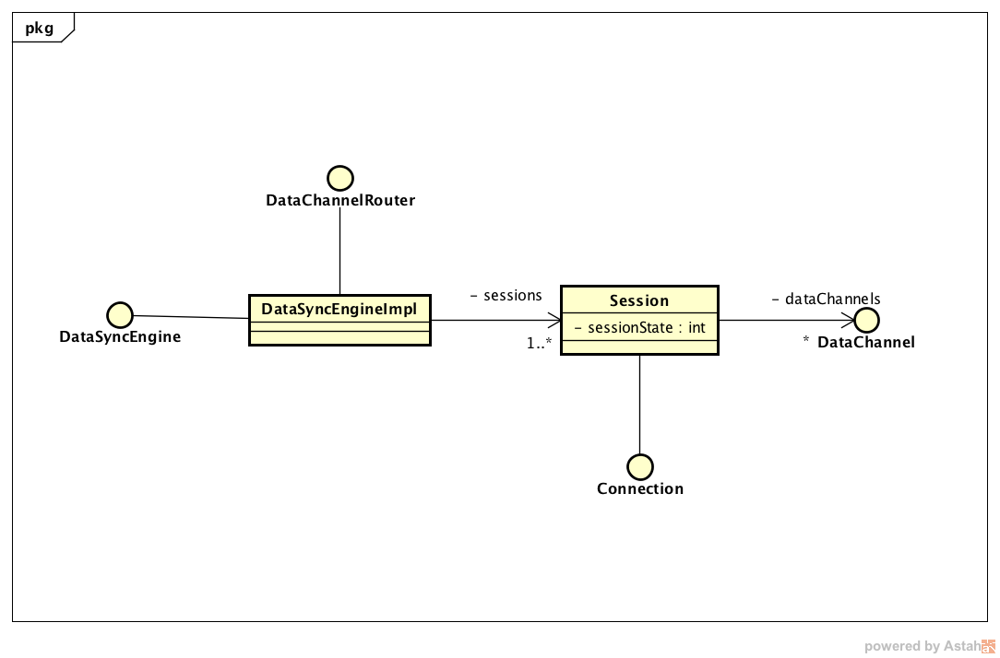

# 类和对象

类和对象是面向对象设计中的最核心的概念，可以把类想象成遗传基因DNA，而把对象想象成为通过类（DNA）创造出来的一个有生命的个体。面向对象设计思想把代码以类为单位进行组织，通过类的继承、对象组合和对象聚合的方式重用代码，通过定义接口和抽象类实现代码可扩展和易维护的目标。

面向对象核心概念：
- 对象 一个对象是运行时被创建在内存中的类的一个实例，通常对象存储在堆内存中。对象有一个关联（分配）的地址保存对象的方法的集合，因此对象是对一个实例状态和行为的封装。创建一个对象需要一个蓝本或规则，面向对象中将这个规则叫做类（Class）这也是为什么把类比作DNA的原因。
- 类 类通过定义一组属性和函数从静态的角度描述一类对象的行为和特征，类是一个用来实现用户定义的类型的结构，例如定义一个叫User的类用于定义一个用户的数据和行为。
- 类成员变量 一个类可以定义0到多个成员变量，成员变量的声明包括制定变量的名称、类型以及作用域。对象则在运行时保存成员变量的值，同一个类创建出来的对象都有相同的成员变量，但是每个对象都各自保存不同的值，这些保存的变量的值被称作对象的状态。而成员变量作用域定义为私有同时提供get和set函数供外部访问的变量叫做属性，Kotlin语言中没有成员变量只有属性。
- 类成员方法 成员方法负责描述一个类的行为，通常实现对成员变量的处理行为以及访问。成员方法描述一个对象的功能和行为。
- 继承 继承是一种类与类之间的关系从而可以基于一个父类定义一个新的子类，子类有与夫类相同的成员变量和方法同时可以扩展父类的公有方法。面向对象编程中使用对类的继承的方法来提供代码重用能力。
- 重载 当一个子类想修改部分父类的方法的时候，可以通过重载的方式覆盖父类的方法，或者通过在重载方法内调用super()函数来执行父类的同名方法来实现扩展而不是覆盖。
- 抽象 抽象的含义是对一类具体的实体的逻辑和行为进行泛化提取出上层逻辑，相当于将公共方法通过定义父类进行抽象，例如定义Person就是对Boy和Gril的抽象。面向对象设计中有一个重要的原则是面向抽象编程（面向接口编程），一个对象应该尽量仅仅依赖抽象的上层类的方法和属性进行编程，而不是一个具体的子类。
- 接口 接口是一个供其它类实现的规范，定义了能对外提供的方法，任何声明实现接口的类都必须提供接口规定的方法的实现。调用放可以仅仅针对接口进行编程而不用依赖具体的实现。很多成熟的面相对象框架实现了IOC容器，可以由外部将接口的实现在运行时从外部注入接口的实现来大道依赖控制反转的目的。
注：我们可以把接口想象成一个插座，插座声明可提供电力，只要符合规范的插头都可以插入取电（欧标，国标还是美标）就可以介入并获取电力且不用关心到底是发电厂提供电力还是便携式发电机提供电力，电力源的切换对用电设备是无感知的，因为这个变化被插座这个协议封装隔离了。

下面的类图是关于一个简单的终端数据同步引擎的设计，数据同步引擎支持两种长链接模式与服务器保持数据同步，以及可以使用HTTP协议发送数据，同时业务层可以通过实现DataChannel接口对通信引擎进行扩展，每一种DataChannel的实现同步一类数据，统一注册到引擎管理并调度，同时引擎提供网络通讯接口作为业务层的服务。

图中包括4个接口DataSyncEngine、Connection、DataChannel和DataChannelRouter，其中DataSyncEngineImple类声明实现DataSyncEngine接口，业务逻辑需要依赖DataSyncEngine提供服务。

<pre><code>
//引擎对外只暴露接口，因此业务逻辑可以仅依赖接口进行编译和测试，而且引擎的实现可以有多种动态切换实现扩展能力
val engine:DataSyncEngint = //从IOC容器获得接口的实现

engine.sendData(data: Data)
</code></pre>

DataSyncEngineImpl类有一个叫sessions的Map集合持有一个到多个会话，每个会话代表与服务器的一个业务层链接，当socket或者websocket与服务器建立链接后，session需要负责与服务器进行认证以及维护一个心跳对长链接进行保活，同时当链接中断时调用Connection的connection函数自动重新建立链接。

接口Connection就是上面提到的插座，session仅仅知道自己引用的接口什么时候，如何去调用，但是不会关心connection的实现是Socket还是Websocket。

而Connection的实现类的职责也很简单，就是收发二进制数据、发起链接、终端链接以及统计收发数据流量。

DataChannel接口则是引擎定义出来需要外层去实现的扩展接口，每个DataChannel就是一个虚拟的数据通道，引擎在sesson建立后，出发所有DataChannel开始同步数据确保客户端数据保持最新。

下面的类图是当前所有的DataChannel的实现，分别负责同步IM消息、通讯录、日程以及email。

这样我们就定义好了各自需要实现的接口，由于基于面向抽象（接口）编程，使得团队可以并发共同开而不必相互依赖，我们只需要定义好边界接口，那么小组成员就可以各自开发一个接口，进行单元测试。最后再通过构造工厂或者依赖注入进行集成。这样开发的好处是，清晰定义的接口可以让我们在开发之前就确定大部分需求是否已经被考虑到，且对接口的讨论充分也证明小组成员都对设计充分的理解，这样不管谁负责哪个接口的实现都不是问题，因此可以更加动态的分配工作实现高效的开发。

一个健壮的系统，应该是分层设计的多个健壮的组件进行集成和扩展实现的。每一层的组件都是对下层组件提供的接口的整合并通过提供功能更加强大的接口为其上层服务。

下面我们定义三个Connection接口的实现：

引擎提供三种远程通信能力，Socket、WebSocket和Http。

最有一张图是一张组建图，描述业务逻辑如何通过实现DataChannel并注入到引擎对引擎的能力进行扩展。

Message是一个组件，组件中的某一个类必须实现DataChannel接口，由引擎触发同步，Message组件通过调用DataSyncEngine接口的sendMessage方法发送同步指令或者发送IM Message。

上面的类图只是一个最原始的设计图，实际项目中还需要考虑性能监控、自适应流量控制、多IP并发重连、长链接与短链接智能切换，数据的编解码以及收发队列和线程池等。但是这些所有的功能，都可以通过上面这个设计不断的进行扩展和重构来实现。

在了解了面向对象设计重，我们如何通过合理的定义不同的类、接口以及类之间的继承关系来组织我们的代码高效的完成业务逻辑，下面我们就开始逐步掌握Kotlin重的面向对象。

## 类和继承

### 类

Kotlin 中使用 class 关键字来声明类：

<pre><code>
class Foo {

}
</code></pre>

一个完整的类的声明，包括类的名称，类的头部（包括类的主构造函数，父类声明），紧跟大括号包括的 body。头部和 body 都是可选的。下面是声明一个类的最简单的形式。

<pre><code>
class Empty
</code></pre>

### 构造函数

一个 Kotlin 类只能有一个主构造函数，但可以有一个或者多个辅助构造函数。主构造函数作为类头部的一部分出现。

<pre><code>
class Person constructor(firstName: String) {
}
</code></pre>

如果主构造函数不包括任何代码或者可见的修改器，constructor 关键字可以省略。

<pre><code>
class Person(firstName: String) {
}
</code></pre>

主构造函数不能包含任何代码，初始化代码可以放在专有的初始化代码块中，初始化代码块紧跟在 init 关键字后：

<pre><code>
class Customer(name: String) {
    init {
        logger.info("Customer initialized with value ${name}")
    }
}
</code></pre>

主构造函数声明的参数可以用于初始化init代码块或类内部的属性。

<pre><code>
class Customer(name: String) {
    val customerKey = name.toUpperCase()
}
</code></pre>

Kotlin 类声明的一种最简洁的形式是仅仅只需要有类名和参数。

<pre><code>
class Person(val firstName: String, val lastName: String, var age: Int) {
    // ...
}
</code></pre>
主构造函数内的变量既可以是 var，也可以是 val 的。

如果构造函数包含注解或者作用域修饰则 constructor 关键字是必需的。作用域修饰要在最前面。

<pre><code>
class Customer public @Inject constructor(name: String) { ... }
</code></pre>

###  次要构造函数

一个类可以有多个次要构造函数，在类 body 中使用 constructor 来修饰。

<pre><code>
class Person {
    constructor(parent: Person) {
        parent.children.add(this)
    }
}
</code></pre>

所有的次要构造函数都必须继承自主构造函数，也可以继承其他已经继承自主构造函数的次要构造函数。使用“:”后跟 this(&lt;parameters&gt;) 的形式。

<pre><code>
class Person(val name: String) {
    constructor(name: String, parent: Person) : this(name) { //继承主函数，或者称为做主构造函数的代理构造函数
        parent.children.add(this)
    }
}
</code></pre>

一个没有任何主次构造函数的非抽象类将默认生成一个没有如参的主构造函数，因此如果想让此类不可以被外部创建。（由类的共有函数来创建）则可以使用下面的方式。

<pre><code>
class DontCreateMe private constructor () {
}
</code></pre>

**注意：如果为 JVM 环境编写程序，需要为主构造函数的参数指定默认值，编译器可以自动生成一个没有参数的构造函数，并为所有参数初始化默认值。这样有助于 Kotlin 类被用在例如 JPA 等一些容器通过无参构造函数，runtime 创建实例的库中。**

<pre><code>
class Customer(val customerName: String = "")
</code></pre>

##  创建对象实例

 可以通过直接调用一个类的构造函数来创建对象，因此，Kotlin 没有 new 关键字。看起来，就像是在调用一个与类同名的函数。

<pre><code>
val invoice = Invoice()
val customer = Customer("Joe Smith")
</code></pre>

### 类的组成

类中包含以下部分：
- 构造函数和初始化代码块
- 函数定义
- 属性
- 匿名类和内部类
- 对象声明

### 继承

继承是面向对象思想中的概念，一个类可以且只可以继承自另一个类。被继承的类称为父类（基类），继承自父类的所有类都称为它的子类。例如：

在面向对象设计中，通过继承方式将逻辑分层，通用的共同的逻辑不断向上层迁移，而底层的具体的需求，向下迁移由子类来承担。（同样的代码永远只存在一份，每当拷贝一处代码到另外一个地方的时候，一定要思考，是否可以避免。）

后面还会介绍，通过组合和聚合的方式，同样可以实现代码的高度重用，同时，组合和聚合比继承增加了在 runtime 时的灵活性，也就是通过组合和聚合，可以在运行时调整一个宿主对象的行为和特性。

Kotlin 的所有的类都继承自 Any 类，不需要声明。因此任何类如果不声明继承关系，则默认继承 Any。

Any 类与 Java 的 java.lang.Object 不同,Any 类只实现 equals()、 hashCode() 和 toString()。

定义类继承关系,在类的头部使用“:”，后跟父类的名字。

<pre><code>
open class Base(p: Int)

class Derived(p: Int) : Base(p)
</code></pre>

如果子类有主构造函数，则可以像想面的代码例子中，将主构造函数的参数来初始化基类的构造函数。（参数 p 作为基类构造函数的如参）如果子类没有主构造函数，则次要构造函数必须使用 super 关键字初始化父类，或者作为其他已经初始化主构造函数的次要构造函数的代理。这里注意的是，子类可以通过调用父类的主要和次要构造函数来完成父类的初始化，同时，子类的不同次要构造函数可以分别调用父类的不同构造函数。

<pre><code>
class MyView : View {
    constructor(ctx: Context) : super(ctx)

    constructor(ctx: Context, attrs: AttributeSet) : super(ctx, attrs)
}
</code></pre>

上面出现的 open 关键字相当于 Java 中的 final 的反作用。因为在 Kotlin 语言中，所有的类都是 final 类型的，只有 open 类型的类才可以被继承。这样设计的原因在于，往往开发过程中，很难将开发的每一个类都设计的适合被继承，在 Java 中，经常是有很多函数，一旦被子类覆盖实现，就会彻底崩溃掉。因此 Kotlin 则采用严谨的态度，只有设计中允许被重载的函数或者基类，才可以通过使用 open 关键字来开放，否则，就允许继承和重载。

### 方法重载

Kotlin 需要明确的使用 override 来声明对父类的 open 类型的函数进行重载。

<pre><code>
open class Base {
    open fun v() {}
    fun nv() {}
}

class Derived() : Base() {
    override fun v() {} //必须使用 override 关键字，否则编译器会警告
}
</code></pre>

没有 open 修饰的函数，子类即使使用了 override 也是不合法的，编译会失败。如果类头部未使用 open 修饰，则函数也不允许为 open 类型。

添加了 override 的方法，本身是可以被它的子类重载的，如果想禁止，则需要增加 final 关键字。

<pre><code>
open class AnotherDerived() : Base() {
    final override fun v() {}
}
</code></pre>

### 属性重载

属性重载的方式和方法重载类似，也是通过 override 声明，且只能重载父类中 open 类型的属性, 但是可以将不可变变量重载为可变变量，反过来也可以。重载不能改变属性的数据类型，只能重载属性的初始化和 get 方法。

注意：override 关键字可以出现在主构造函数的参数列表中。

<pre><code>
interface Foo {
    val count: Int
}

class Bar1(override val count: Int) : Foo

class Bar2 : Foo {
    override var count: Int = 0 //在此增加属性默认值，以及将不可变属性重载为可变属性。
}
</code></pre>

### 重载规则

Kotlin 中重载有一个需要遵守的规则，如果一个类的上层存在同一个方法的多个实现的话（例如，父类和接口扩展都实现了同一个方法），则子类必须重载此方法并提供自己的实现。这时 Java 面向对象中不可能出现的情况。一种简单的方式是，在子类的实现中，通过 super&lt;type&gt; 这个关键字来

<pre><code>
open class A {
    open fun f() { print("A") }
    fun a() { print("a") }
}
interface B {
    //后面会讲到，Kotlin 中接口可以提供默认的实现，着类似 Swift 中的扩展，因此可以不通过集成，直接通过扩展的方式，为任何类增加新的方法。即能力。
    fun f() { print("B") } // 接口中的方法默认是 open 类型的
    fun b() { print("b") }
}
class C() : A(), B {
    // 因为这个类的父类和接口中都实现了这个方法，因此，即使没打算在子类从载，编译器也需要我们提供一个明确的实现来避免歧义。
    // 这里，我们可以简单的通过
    override fun f() {
        super&lt;A&gt;.f() // call to A.f()
        super&lt;B&gt;.f() // call to B.f()
    }
}
</code></pre>

## 抽象类

同 Java 一样，可以通过 abstract 来定义抽象类和抽象方法。抽象方法没有具体的实现。且因为抽象函数就是希望被子类实现的，因此，不需要使用 open 修饰，就可以被子类重载。

<pre><code>

open class Base {
    open fun f() {}
}
abstract class Derived : Base() {
    override abstract fun f()
}

</code></pre>

## 伴生对象

因为 Kotlin 是没有 static 关键字的，因此类没有静态方法。推荐直接使用 package 作用域下的函数来代替。

如果想定义一个方法，不通过获得一个类的实例直接调用，但同时又想访问被调用对象的内部。（例如，工厂方法）可以在被调用类内用 companion object 关键字声明一个内部类，在半生对象内，可以像在 Java 中调用静态方法一样，来调用宿主对象内的方法，只是需要使用宿主的类名作为前缀

<pre><code>

class MyClass {

    fun hello() {}
    companion object CompanionObj {
        fun touchIt(): {
            MyClass.hello()
        }
    }
}

</code></pre>

### 属性和字段（property and fields）

在面向对象设计中，一个类可以具有多种属性，例如，我们创建一个类来代表员工（Staff），每个公司的员工，都有工龄、薪资、入职时间、职位、部门等信息，这些都是一个员工的属性，这些都是 Staff 类的 properties。

属性为一个类的状态，外部只可以通过 getter 和 setter 函数来访问一个类的属性。而字段则是一个类下的变量，外部可以直接访问，不需要通过 getter 和 setter 函数，但是，Kotlin 不支持字段。

类可以有多个属性。可以声明成可变属性 var 和不可变 val 两种。

<pre><code>
class Address {
    var name: String = ...
    var street: String = ...
    var city: String = ...
    var state: String? = ...
    var zip: String = ...
}
</code></pre>

可以通过属性名直接引用一个属性。

<pre><code>
fun copyAddress(address: Address): Address {
    val result = Address() // there's no 'new' keyword in Kotlin
    result.name = address.name // accessors are called
    result.street = address.street
    // ...
    return result
}
</code></pre>

### Getter 和 Setter

声明一个属性的完整语法

<pre><code>
var &lt;propertyName&gt;[: &lt;PropertyType&gt;] [= &lt;property_initializer&gt;]
    [&lt;getter&gt;]
    [&lt;setter&gt;]
</code></pre>

property_initializer、getter、setter 都是可选的，如果 initializer 存在，或者 getter 提供返回值可以让编译器推断出属性类型，则 PropertyType 也是可选的。

<pre><code>
var allByDefault: Int? // error: 需要明确的初始值
var initialized = 1 // 定义 Int 类型的变量 initialized，缺省的 getter 和 setter 函数
</code></pre>

不可变属性以 val 开头，且不允许又 setter 函数。

<pre><code>
val simple: Int? // Int类型变量simple， 默认的getter函数实现，因为是不可变，因此必须要在类的构造函数中初始化。
val inferredType = 1 // 取值为1的 Int 类型变量 inferredType，默认的 getter 函数实现。
</code></pre>

可以自定义 getter 函数：

<pre><code>
val isEmpty: Boolean
    get() = this.size == 0
</code></pre>

代码中，this 关键字是对当前类实例的引用。

自定义 setter 函数：

<pre><code>
var stringRepresentation: String
    get() = this.toString()
    set(value) {
        setDataFromString(value) // parses the string and assigns values to other properties
    }
</code></pre>

缺省的 setter 如参叫 value，大部分时候，直接使用 value 这个名字会很方便，但是，也可以使用一个自定义的的名字来代替 value 这个缺省值。

Kotlin 1.1 以后，可以通过自定义 getter 函数的返回类型来指定属性的类型。

<pre><code>
val isEmpty get() = this.size == 0 // has type Boolean
</code></pre>

如果只想改变属性的作用域，或者对其进行注解，但是不想自定义属性的 getter 和 setter 函数，可以省略函数的 body：

<pre><code>
var setterVisibility: String = "abc"
    private set // 这里不需要提供setter的body
var setterWithAnnotation: Any? = null
    @Inject set // 后面向大家介绍注解的概念
</code></pre>

辅助字段 （Backing Field）

Kotlin 中的类是不支持字段的。但是，当实现自定义 setter 函数的时候，需要一个辅助字段来访问 property，当且仅当在 setter 中，可以使用关键字 field 来访问 property。

<pre><code>
var counter = 0 // value 的值被直接赋值给property， 通过使用辅助字段
    set(value) {
        if (value >= 0) field = value
    }
</code></pre>

field 关键字仅可以在属性的访问函数（getter 和 setter）中使用。

当在属性访问函数中使用 field，或者至少自定义一个访问函数时，辅助字段会被自动生成。

例如，下面这段代码中，field 是不需要的

<pre><code>
val isEmpty: Boolean
    get() = this.size == 0
</code></pre>

### 辅助属性 (Backing Property)

如果 ，实现的属性访问函数没法使用辅助字段来实现，可以声明一个私有的辅助属性。

<pre><code>
private var _table: Map<String, Int>? = null //辅助属性
public val table: Map<String, Int>
    get() {
        if (_table == null) {
        _table = HashMap() 
    }
    return _table ?: throw AssertionError("table属性被其它线程释放") //由于getter 外部使用了_table，因此，我们没办法使用field的方式，在getter中为属性赋值。因此必须使用辅助属性。
}
</code></pre>

辅助属性必须是私有的，因此，和 Java 语言中访问私有属性的方式相同，且同样没有默认的 getter 和 setter 函数，因此，对辅助属性的访问，不会产生函数调用。

### 编译时常量

如果在编写代码的时候，一个属性的值就已经被确定，且不会再被改变（例如一些配置属性），则可以声明为编译时常量。可以为属性添加 "const" 来修饰。

编译时常量必须满足以下条件：

- 必须是全局或者属于一个对象
- 类型必须是 string 或者其他原始类型
- 没有自定义 getter 函数

编译时常量可以用在注解中（配置属性）

<pre><code>
const val SUBSYSTEM_DEPRECATED: String = "This subsystem is deprecated"
@Deprecated(SUBSYSTEM_DEPRECATED) fun foo() { ... }
</code></pre>

### 后赋值属性

Kotlin 的属性分为可选属性用 ？ 注明（optional）和 非空属性 ！号注明，未指定时，属性默认都是非空属性。

非空属性必须要在构造函数中声明，但是有的时候，没法在构造函数中赋值，但是，又想声明成非空属性，这样引用这个属性的所有地方，就都不用做判空处理了。例如，在对象构造后，由依赖注入框架赋值或单元测试中的 setup 函数中赋值等，可以使用 lateinit 关键字来告诉编译器，稍后会第一时间为此属性赋值。

<pre><code>
public class MyTest {
    lateinit var subject: TestSubject
    @SetUp fun setup() {
        subject = TestSubject()
    }
    @Test fun test() {
        subject.method()
    }
    // dereference directly
}
</code></pre>

注意只有可变属性 var 才可以后赋值。如果在后赋值属性被初始化之前访问此属性，则会抛出特定的异常来告诉开发者。

## 接口 （Interface）

Kotlin 的接口和 Java8 十分相似,其实作者认为跟 Swift 的 protocol 更像。接口是面向对象中非常重要的一个概念。但是，纯面向对象中的接口必须全部都是抽象函数，即只有函数的定义没有 body，声明实现此接口的类，必须提供接口中抽象函数的实现。Kotlin 中的接口，即可以是抽象函数，也可以提供默认实现，即非抽象函数。但是，接口是不可以保存属性的状态。因此，不可以在接口中给属性赋值，要么声明抽象属性，要么为属性提供自定义访问函数。

接口使用 interface 关键字来声明:

<pre><code>
interface MyInterface {
    fun bar()
    fun foo() {
        // 函数的实现是可选的。
    }
}
</code></pre>

### 实现接口

一个类可以声明实现多个接口:

<pre><code>
class Child : MyInterface {
    override fun bar() {
        // body
    }
}
</code></pre>

### 接口中的属性

接口中也可以声明属性。可以声明抽象接口定义，或者提供自定义的访问器函数。接口中的属性不能使用辅助域变量，因此，接口中的访问器不可以使用。

<pre><code>
interface MyInterface {
    val prop: Int // abstract
    val propertyWithImplementation: String
    get() = "foo"
    fun foo() {
        print(prop)
    }
}

class Child : MyInterface {
    override val prop: Int = 29
}
</code></pre>

### 作用域标识

类、对象、接口、构造函数、函数、属性和属性 getter 可以用作用域修饰来指定可见作用域。（Getter 的作用域与属性声明的作用域相同，不可以单独指定）一共有 4 种作用域：私有(private)、保护(protected)、内部(internal) 和 公共(public)。未指名作用域的时候，默认的作用域是 public。

#### 包作用域 (Packages)

函数，属性，类、类的对象和接口都可以被声明在 Packages 下。作为顶层元素。

<pre><code>
// file name: example.kt
package foo

fun baz() {}
class Bar {}

</code></pre>

- 如果在包内的顶层声明的元素，没有指定任何作用域，则都为 public，这些元素将全局可见。
- 如果声明私有元素，则元素的作用域仅限于文件内部。
- 如果定义 internal，则此元素仅模块内可见（Kotlin 中 Model 被定义为一组源代码文件被独立的编译并打包到一起）。
- 包的顶层元素不可以使用 protected，因为 protected 主要用户在对象继承关系中，仅子类可见。因此，只在类内部使用。

<pre><code>
// file name: example.kt
package foo

private fun foo() {} // visible inside example.kt

public var bar: Int = 5 // property is visible everywhere
    private set // setter is visible only in example.kt

internal val baz = 6 // visible inside the same module

</code></pre>

#### 类和接口作用域

在类中，可以使用 private、protected、internal 和 public 全部这 4 种修饰。

- private 私有作用域，仅当前类可见。
- protected 仅当前类和其子类可见。
- internal 模块内可见。
- public 对任何类可见。

Java 开发者注意：在 kotlin 中，一个类的内部类的 private 元素对其宿主不可见。

<pre><code>
open class Outer {
    private val a = 1
    protected open val b = 2
    internal val c = 3
    val d = 4 // public by default

    protected class Nested {
        public val e: Int = 5
    }
}

class Subclass : Outer() {
    // a is not visible
    // b, c and d are visible
    // Nested and e are visible

    override val b = 5 // 'b' is protected
}

class Unrelated(o: Outer) {
    // o.a, o.b are not visible
    // o.c and o.d are visible (same module)
    // Outer.Nested is not visible, and Nested::e is not visible either
}
</code></pre>

#### 构造函数

为主要构造函数设置作用域的方式：

<pre><code>
class C private constructor(a: Int) { ... }
</code></pre>

未设置作用域时，主构造函数都为 public，有时，如果一个类仅做工具类或者想确保全局仅有一个实例时，可以将构造函数私有化来禁止外面构造这个对象。

#### 模块

上面提过关键字 internal 作用域代表被修饰的元素尽在模块内可见。而一个模块为代码文件的集合，例如：
- Intellig IDEA module
- Maven 或者 gradle 的项目
- 或者是一个 ant task 打包的 jar

##扩展（Extensions）

和 C#、Swift 相似，Kotlin 可以在不需要继承基类的情况下直接对类进行扩展，也不需要通过任何设计模式（适配器）来实现逻辑的绑定和注入。Kotlin 可以实现函数扩展和属性扩展。尤其是在无法修改依赖的模块内的对象的时候，但是又想对其进行一定的扩展的时候，可以很轻松地达到目标。

### 函数扩展

声明对函数的扩展，只需要在扩展函数的名字前面，使用被扩展类的名字作为前缀，并用“.”来分割。下面的例子将函数 swap 扩展到 MutableList&lt;Int&gt;:

<pre><code>
fun MutableList&lt;Int&gt;.swap(index1: Int, index2: Int) {
    val tmp = this[index1] // 'this' corresponds to the list
    this[index1] = this[index2]
    this[index2] = tmp
}
</code></pre>

扩展函数内的 this 代表被扩展的类，现在为 MutableList 扩展了一个函数 swap，现在可以调用这个扩展函数了。

<pre><code>
val l = mutableListOf(1, 2, 3)
l.swap(0, 2) // 'this' inside 'swap()' will hold the value of 'l'
</code></pre>

上面函数中用到了范型（generic）。MutableList 本身是个范型化的容器，函数扩展也可以同样用在范型中，例如上面的函数扩展可以改写为：

<pre><code>
fun &lt;T&gt; MutableList&lt;T&gt;.swap(index1: Int, index2: Int) {
    val tmp = this[index1] // 'this' corresponds to the list
    this[index1] = this[index2]
    this[index2] = tmp
}
</code></pre>

### 扩展的静态确定

扩展函数对类的扩展是静态时确定的，即编译时，一方面，扩展函数并不是被添加到类上的，同时也不是动态的为类增加了虚拟的函数。Kotlin 仅仅通过增加了一个函数，并使这个函数可以通过变量调用到而已。

由于扩展是静态确定的，因此，没有办法通过运行时根据对象的实际类型来确定调用的具体函数的实现，只能通过编写代码时，通过代码中的对象的类型，来确定调用哪个具体的扩展函数。就是说，子类扩展，是不能重载基类的扩展函数的，如果代码里声明的是基类类型的变量，则只能调用到对基类的扩展函数。

<pre><code>
open class C

class D: C()

fun C.foo() = "c"

fun D.foo() = "d"

fun printFoo(c: C) { // 由于入参确定了类型为C， 因此即使我们传入的实际上是子类，只有C 类的扩展函数会被调用。
    println(c.foo())
}

printFoo(D()) // 输出 "c"
</code></pre>

最终结果是输出 c， 因为目标扩展函数是通过入参 c 的声明类型来确定的，变量 c 的类型是 C， 因此对 C 的扩展函数 C.foo() 将会被调用。

如果类内成员函数已经有同名和相同入参的话，外部的同名相同入参的扩展函数会不起作用。例如：

<pre><code>
class C {
    fun foo() { println("member") }
}

fun C.foo() { println("extension") }
</code></pre>

输出结果为"member"

如果仅仅是名字相同，入参签名不同，则扩展函数可以起作用。

<pre><code>
class C {
    fun foo() { println("member") }
}
fun C.foo(i: Int) { println("extension") }

C().foo(1) //will print extension
</code></pre>

### 被扩展类可控

扩展函数可以使用 ？ 标识声明被扩展对象（receiver）为可空类型，因为可以调用变量对象上的扩展函数，因此，变量本身有可能为空，可以使用 ？ 标识修饰扩展函数，并在函数内对 this 进行非空判断。

下面的扩展允许开发人员可以放心的对任何对象变量调用 toString() 函数，不管变量是否为空。

<pre><code>
fun Any?.toString(): String {
    if (this == null) return "null"

    // after the null check, 'this' is autocast to a non-null type, so the toString() below
    // resolves to the member function of the Any class
    return toString()
}
</code></pre>

### 扩展属性

扩展属性和扩展函数非常相似：

<pre><code>
val <T> List<T>.lastIndex: Int
    get() = size - 1
</code></pre>

因为扩展机制是静态时建立的，实际上扩展属性并不在类内部，因此，扩展属性是没有办法有辅助字段的。这是为什么构造函数内不可以应用扩展属性的原因。

### 伙伴对象的扩展

如果类中存在伙伴对象定义，同样可以对其进行函数扩展和属性扩展。

<pre><code>
class MyClass {
    companion object { } // will be called "Companion"
}

fun MyClass.Companion.foo() {
    // ...
}
</code></pre>

对伙伴对象的调用方式与普通类的函数和属性没什么区别

<pre><code>
MyClass.foo()
</code></pre>

### 扩展的范围

通常直接在包下面定义扩展。

<pre><code>
package foo.bar

fun Baz.goo() { ... }
</code></pre>

如果想在包内使用包之外的扩展来扩展包内部的类，只需要对其进行导入，使用关键字 import。

<pre><code>
package com.example.usage

import foo.bar.goo // 导入foo.bar.goo 包下的所有扩展

// 或者

import foo.bar.* // 从 "foo.bar" 导入所有元素，包括扩展，类，函数 

fun usage(baz: Baz) {
    baz.goo()
)
</code></pre>

### 类内定义扩展

可以在类内部定义对外部类的扩展，在扩展函数内可以访问到类本身的所有对象成员和函数，就像这个类里的其他成员函数一样。

<pre><code>
class D {
    fun bar() { ... }
}

class C {
    fun baz() { ... }
    fun D.foo() {
        bar() // calls D.bar
        baz() // calls C.baz
    }
    fun caller(d: D) {
        d.foo() // call the extension function
    }
}
</code></pre>

如果类内扩展函数调用的函数，在被扩展类中也被声明，存在冲突。则在冲突发生的时候，被扩展类的实现将被调用，如果想调用宿主类中的函数，则需要 @ 符号后跟类名来区分。

<pre><code>
class C {
    fun D.foo() {
        toString() // 调用 D.toString()
        this@C.toString() // 调用 C.toString()
    }
}
</code></pre>

类内部的函数扩展可以是 open 作用域的，且可以被子类重写。相当于，类中的成员扩展函数的实现取决于构造的是哪个类，基类还是子类，但是，对被扩展对象来说，其扩展函数的实现依然在静态时被确定。

<pre><code>
open class D {
}

classlass D1 : D() {
}

open class C {
    open fun D.foo() {
        println("D.foo in C")
    }

    open fun D1.foo() {
        println("D1.foo in C")
    }

    fun caller(d: D) {
        d.foo() // 静态时确定实现
    }
}

class C1 : C() {

    override fun D.foo() {
        println("D.foo in C1")
    }

    override fun D1.foo() {
        println("D1.foo in C1")
    }

}

C().caller(D()) // prints "D.foo in C"
C1().caller(D()) // prints "D.foo in C1" - caller函数静态确定调用D的扩展函数 foo() ,同时foo() 的实现被C1 类重写
C().caller(D1()) // prints "D.foo in C" - caller函数静态时去定调用对D的扩展函数 C.foo() 的扩展
</code></pre>

### 使用扩展的动机

在 Java 语言中，有的时候会创建带有 Utils 后缀的类，用于放一些公共的无状态的静态工具函数。例如 Java 中非常著名的集合工具类 java.util.Collections 中提供了一些工具函数来方便处理数据集。

<pre><code>
// Java
Collections.swap(list, Collections.binarySearch(list, Collections.max(otherList)), Collections.max(list))
</code></pre>

使用 Java 静态导入这个类（Kotlin 没有静态导入的概念），曾经使用 Java 开发过 elasticsearch 的查询条件构造的话，就对此更熟悉了。

<pre><code>
static import java.util.Collection.*
// java
swap(list, binarySearch(list, max(otherList)), max(list)) //函数实现是由Collection提供，因为交换需要对list对象进行操作，所以入参需要也将list本身作为参数传递给swap函数。
</code></pre>

使用 Kotlin 扩展，可以将函数直接扩展到对象中，也可以直接对变量进行函数调用。而如果想在 Java 里实现下面的效果，就只能通过实现一个 List 类，并实现基类里的所有必须被子类实现的抽象函数。因为 List 本身是抽象类，里面定义了很多抽象函数。

<pre><code>

func List.swap(list: List) {}

list.swap(list.binarySearch(otherList.max()), list.max())
</code></pre>

通过上面的写法，仅需要实现一个函数，并扩展到了所有 List 类的实例上。

## 数据类 （Data Class）

在面向对象编程思想中，倾向于为每一个数据格式定义一个类，仅封装结构化数据，并提供一些机械化的成员函数，大部分 Java 序员都熟知如何用 IDE 快捷键来快速生成这些机械化的代码。在 Kotlin 可以仅使用 data 关键字来声明一个类，就可以了，连使用快捷键的操作都是多余的。

<pre><code>
data class User(val name: String, val age: Int)
</code></pre>

编译器将会自动根据主构造函数的参数列表，自动生成下面的成员函数：
- data 象的 equals 和 hashCode 对
- toString 方法的返回内容如："User(name=John, age=42)"
- componentN() 一种根据索引 N 取参数值的成员函数，编译器会根据类的属性声明的顺序来生成 componentN() 函数，例如，可以通过对 User 的实例 user 调用 user.component1() 来获得属性 name 的值。
- copy 函数。

如果上面的任何一个函数在当前类的 body 中定义，或者被子类重写，则编译器将不会生成默认实现。

编译器自动生成的函数需要对数据对象提供一致性，完整性。数据类需要满足以下几点：
- 主构造函数必须至少有一个属性参数。
- 所有主构造函数的属性必须用 val 或者 var 来标记
- 对象类不可以是抽象类，open 作用域，封闭类和内部类。（下一节会介绍封闭类）
- 在 kotlin 1.1 之前，数据类只能作为接口的实现

如果是在 JVM 上运行，则必须为数据类的所有构造函数的属性指定默认值。

<pre><code>
data class User(val name: String = "", val age: Int = 0)
</code></pre>

### 数据类的 copy

数据类自动生成的 copy 函数可以实现在对对象的克隆的同时，允许更改部分属性的值，这会给编写函数式风格的程序带来极大的帮助。在函数式编程中，一个函数不改变外部变量，仅是对一个特定输入属性的特定处理，并返回结果。因此，函数式编程不提倡直接改变对象的值来影响函数，而是通过 copy 并改变 copy 后的对象，并作为处理结果返回出来。这样每一个函数都是线程安全的，不需要额外的使用同步来保证线程安全。同时，也非常容易被测试，因此每一个输入，都有唯一的一个输出结果。而在 Swift 开发中，就没有这样的特性，因此我们会编写很多辅助函数，一般叫做透镜，来完成类似的逻辑。但是在 Kotlin 中，仅仅只需要一个关键字 data，太轻松了。

后面会介绍相应式函数编程（FRN），来为读者介绍一套比较完善的框架来实现状态管理和功能分离，通过信号绑定来实现与面向对象一样灵活的开发模式。

编译器自动生成的 copy 函数例子：

<pre><code>
fun copy(name: String = this.name, age: Int = this.age) = User(name, age)
</code></pre>

因此可以像下面的代码一样，改变 age 的值，并产生一个新的对象：

<pre><code>
val jack = User(name = "Jack", age = 1)
val olderJack = jack.copy(age = 2)
</code></pre>

### 数据类对象属性的拆包赋值 (Destructuring Declarations)

数据类自动生成的 componentN 函数的作用之一是辅助完成属性的拆包赋值:

<pre><code>
val jane = User("Jane", 35)
val (name, age) = jane
println("$name, $age years of age") // prints "Jane, 35 years of age"
</code></pre>

上面的代码中，将一个数据类赋值给一个有两个属性的元组

### 标准数据类

Kotlin 标准库中，定义了两个数据类二元组（Pair）和三元组（Triple），Kotlin 提供这两个标准数据类，是为了方便开发人员在不产生新的类的时候，可以方便的将已有的几个数据，快速组装成新的数据格式。面向对象编程倾向于在这样的场景下，创建专门的类来封装，函数式编程更倾向于使用已有的数据格式，即在函数式编程中，不是给这个新的数据格式定义类，而是，定义处理这个数据的函数。因为函数式编程中，会更多的使用通用的数据结构，map、list 和元组来封装数据，同时为每一种数据提供丰富的函数来处理。

二元组和三元组的定义在 kotlin-runtime.jar 中的 Tuples.kt 中。

## 封闭类（Sealed Classes）

封闭类的作用是封闭类的继承关系，当一个变量的类型只能是一组类型中的一种的时候，可以使用封闭类来进行限制。封闭类使用 sealed 来定义，封闭类仅仅只有一个类名称，没有构造函数、属性和 body。继承自同一个封闭类的子类形成了一个封闭的集合，当编写函数的时候，期望传入函数的属性必须是这个集合的类的情况下，可以将属性类型定义成这个集合的父类，即封闭类。这样可以用 when 语句来进行模式匹配，为每一个集合中的类匹配一种处理逻辑。使用封闭类定义入参就可以限定函数外只能传入属于这个集合的类型对象。when 语句也可以用在枚举上，封闭类与枚举的区别在于，封闭类可以是多实例，且每个实例可以保存状态。（类因为可以有属性，属性保存的即为类的状态）

封闭类的一个约定是，一个封闭类的子类，都必须定义在与封闭类相同的文件中。

<pre><code>
sealed class Expr
data class Const(val number: Double) : Expr()
data class Sum(val e1: Expr, val e2: Expr) : Expr()
object NotANumber : Expr()

fun eval(expr: Expr): Double = when (expr) {
    is Const -> expr.number
    is Sum -> eval(expr.e1) + eval(expr.e2)
    NotANumber -> Double.NAN
    // 'else' 是不需要的，因为已经覆盖了 Expr 集合中的所有子类。
}
</code></pre>

**注意，上面的代码中，数据类继承封闭类的特性只有在 Kotlin1.1 之后才被支持，1.1 以下版本，数据类是不允许继承其自其它类的。**

在使用 when 进行模式匹配的时候，编译器会检测是否所有的类型都有一个处理，如果是，则不会强制使用 else 来设置默认处理分支，如果不是，则必须提供一个默认条件，否则编译器会警告。

## 范型（Generics）  

有的时候，我们称使用范型的类叫模板类，模板类也是一种抽象，一种逻辑的通用实现，与继承不同的是继承关系是在编译时就确定的（静态时），而模板类可以在运行时采取确定模板中操作的变量的类型，因此，可以针对具有同一种能力的不同类指定一套通用逻辑，并在构造模板类的时候，指定其操作的具体类型。这样，整个模板类，就会变成操作此类型对象的定制类。例如：

<pre><code>
class Box&lt;T&gt;(item: T) {
    var i = item
}

var box:Box&lt;T&gt; = Box&lt;T&gt;(1)

println("print box value: $box.i")
</code></pre>

代码中开始定义了一个 Box 容器类后面的“&lt;T&gt”;指定一个要被替换的符号，构造函数的入参 item 的类型将在运行时被指定为具体的 type。紧跟着定义的box 变量，构造了一个以 Int 类型为入参的 Box 对象，这个时候，才真正确定了 T 的类型。

如果构造函数中有出现模板中需要被确定的所有待定符号，则声明变量的时候，可以省略区变量声明后面的类型。

<pre><code>
val box = Box(1)
</code></pre>

### 类型转换 (Variance)

Java 中有种巧妙的机制，叫通配符(wildcard) List&lt;? extends E&gt;，这样，任何继承自类型 E 的对象，都可以放入这个列表中去。Kotlin 没有这样的机制，Kotlin 引入两种机制来替代通配符：编译时变形和类型预测。

使用通配符的目的是使代码有更好的可扩展性，&lt;? extends E&gt;代表匹配所有 E 的子类，但是在模板内部的代码，仅仅只针对 E 来编写代码，也就是面向抽象层编写自己的模板，但是对于构造模板类，则可以面向具体的实现来编写，构造的地方是确定构造的模板对象是针对那个具体的类型的，因此，可以减少很多强制类型转换，也使得模板类不仅可以处理 E 类型，也可以处理所有 E 的子类。

但是，Java 通配符也存在限制，首先通配符模板类是不可以类型转换的，例如 List&lt;String&gt;不是 List&lt;Object&gt;。如果允许这样的类型转换，意味着，转换后的 List 容器可以放入所有类型，而不仅只是 String。因此下面的代码，将会在运行时抛出异常（ClassCastException）。

<pre><code>
// Java
List&lt;String&gt; strs = new ArrayList&lt;String&gt;();
List&lt;Object&gt; objs = strs; // !!! 实际上java是不允许这样的类型转换的，如果允许，则会存在接下来的异常的可能!
objs.add(1); // 我们这里在数组的最前面添加了一个Int 类型的对象。
String s = strs.get(0); // !!! ClassCastException: Cannot cast Integer to String
</code></pre>

上面的例子是为了说明，如果允许类型转换会带来异常。实际上 Java 是禁止这样的类型转换，以此来避免运行时的异常。但是这样限制也有一些不便，例如，看一下Java 中的 Collection 接口中的 addAll() 函数。addAll() 函数的定义是什么？比较直接的定义方式是：

<pre><code>
// Java
interface Collection&lt;E&gt; ... {
    void addAll(Collection&lt;E&gt; items);
}
</code></pre>

但是这个接口是不能在下面的场景中工作的。

<pre><code>
// Java
void copyAll(Collection&lt;Object&gt; to, Collection&lt;String&gt; from) {
    to.addAll(from); // !!! 这里无法通过编译 addAll:
    //Collection&lt;String&gt; 并不是 Collection&lt;Object&gt; 的子类
}
</code></pre>

因此实际上，Java 中 Collection 的 addAll() 函数是这样定义的：

<pre><code>
// Java
interface Collection&lt;E&gt; ... {
    void addAll(Collection&lt;? extends E&gt; items);
}
</code></pre>

可以定义一个简单的原则，如果只从容器里获取对象，则可以使用类型转换将 String 容器转换成 Object 容器，并从中读取对象。反过来，如果将 String 对象写入 Object 集合，也是可以的。在 Java 中可以定义 List&lt;? super String&gt; 为 List&lt;Object&gt; 的子类，称作逆变换。

### 编译时类型转换

假如定义范型接口 Iterator&lt;T&gt; 其中没有函数以 T 类型作为入参，仅含有一个返回类型为 T 的函数 next。

<pre><code>
// Java
interface Iterator&lt;T&gt; {
    T nextT();
}
</code></pre>

这样的场景下，将 Iterator&lt;String&gt; 类型转换成一个 Iterator&lt;Object&gt; 属性并是安全地使用，因为没有函数会试图向容器中添加对象。但是下面这种情况依然是不允许的：

<pre><code>
// Java
void demo(Iterator&lt;String&gt; strs) {
    Iterator&lt;Object&gt; objects = strs; // !!! 在java中，这样赋值是不允许的
    // ...
}
</code></pre>

为了解决这个问题，必须将迭代器声明为 Iterator&lt;? extends Object&gt;,这样可以放入任何 Object 对象的子类中，同时模板类中，仅调用对 Object 类型的代码，但是，不能再把这个迭代器再转化到 Iterator&lt;String&gt; 了，因为不确定 Object 容器内存存储的是否都是 String 类型。

在 Kotlin 中，有一种方式可以告知编译器。就是编译时类型转换：可以对 Iterator 的类型参数前增加一个注解来告知编译器保证范型类型仅作为函数的结果返回类型,但是不会作为函数的入参。

<pre><code>
abstract class Iterator&lt;out T&gt; {
    abstract fun nextT(): T
}

fun demo(strs: Iterator&lt;String&gt;) {
    val objects: Iterator&lt;Any&gt; = strs // This is OK, since T is an out-parameter
    // ...
}
</code></pre>

out T 的含义就是告诉编译器，只会从迭代器中获取数据，不会向 Iterator 中添加对象。（只出不进）编译时类型转换，实际上含义是，在编写代码的时候确定通过 out 属性通知编译器，不会试图向容器中添加对象。

与 out 相呼应的是 in 注解，in 注解用来在编译的时候告知编译器，相应的属性是可逆变的。含义与 out 相反，in 修饰的属性仅作为方法的入参，不能作为结果返回。例如：Comparable。

<pre><code>
abstract class Comparable&lt;in T&gt; {
    abstract fun compareTo(other: T): Int
}

fun demo(x: Comparable&lt;Number&gt;) {
    x.compareTo(1.0) // 1.0 has type Double, which is a subtype of Number
    // Thus, we can assign x to a variable of type Comparable&lt;Double&gt;
    val y: Comparable&lt;Double&gt; = x // OK!
}
</code></pre>

上面代码中因为 Comparable 不存在以 T 为结果返回的函数，因此可以将 Comparable&lt;Number&gt; 赋值给 Comparable&lt;Double&gt; 的属性。因为 Double 是 Number 的子类型，只要子类型的容器只消费这个对象，并不将对象通过函数调用结果传递给容器外，就不会造成任何问题。

### 类型推测

类型推测是编译器在容器被使用的时候，通过上下文推测出范型参数的类型的方式。有的时候，实现的模板类没有办法保证只返回类型 T，例如:

<pre><code>
class Array&lt;T&gt;(val size: Int) {
    fun get(index: Int): T { /* ... */ }
    fun set(index: Int, value: T) { /* ... */ }
}
</code></pre>

这个范型类不是非常的灵活，当实现一个数组拷贝函数的时候，同样只能实现两个 Any 的数组间的 copy，但是没法通过范型指定任何 Any 的子类的数组 copy 到 Any 的数组中。

<pre><code>
fun copy(from: Array&lt;Any&gt;, to: Array&lt;Any&gt;) {
    assert(from.size == to.size)
    for (i in from.indices)
        to[i] = from[i]
}

val ints: Array&lt;Int&gt; = arrayOf(1, 2, 3)
val any = Array&lt;Any&gt;(3) { "" }
copy(ints, any) // Error: 这里会抛出ClassCaseException异常。
</code></pre>

在 Kotlin 中，可以通过使用时类型转换来解决这个问题，即不再 Array 类的参数上使用 out，而是在使用这个模板的函数上使用 out，以上面的 copy 为例，只需要在 from 数组上使用 out 就可以解决上面发生的异常。

<pre><code>
fun copy(from: Array&lt;out Any&gt;, to: Array&lt;Any&gt;) {
    // ...
}
</code></pre>

同样，Kotlin 也支持使用时逆变，即在使用模板的函数中使用 in 关键字。例如若要实现使用默认值填充整个数组：

<pre><code>
fun fill(dest: Array&lt;in String&gt;, value: String) {
    // ...
}
</code></pre>

这里使用 in 是因为数组本身是 Any 类型的，fill 函数本身并不从数组里获取对象，仅是将 Any 的子类 String 类型的对象赋值给数组中，也就是 dest 数组仅消费 value，但是不产出 value。

### 函数范型

Kotlin 的特点是函数式编程与面向对象编程正交，即同时存在且不相互产生副作用，因此，面向对象中的范型也被延伸到了函数中。

可以定义函数的范型：

<pre><code>
fun &lt;T&gt; singletonList(item: T): List&lt;T&gt; {
    // ...
}

fun &lt;T&gt; T.basicToString() : String { // extension function
    // ...
}
</code></pre>

与类不同，函数的类型参数，不单可以是函数的入参的类型，也可以作为对类型的扩展函数。singletonList 函数声明输入 T 类型作为入参，返回容纳 T 类型的 List，而 basicToString 的前面 T 代表将此函数扩展到 T 类上。

调用范型函数，需要在调用的时候，在函数名后面指定具体的类型：

<pre><code>
val l = singletonList&lt;Int&gt;(1)
</code></pre>

### 上界限制 （Upper bounds）

在开发中最普遍的约束限制就是指定范型类型的上界限制，上界限值对应 Java 中的 extends 关键字：

<pre><code>
fun &lt;T : Comparable&lt;T&gt;&gt; sort(list: List&lt;T&gt;) {
    // ...
}
</code></pre>

值得一提的是，这里的范型是双重约束，即首先 list 的类型必须是 T 的子类，且 T 必须是 Comparable&lt;T&gt; 的子类。例如：

<pre><code>
sort(listOf(1, 2, 3)) // OK. Int is a subtype of Comparable&lt;Int&gt;
sort(listOf(HashMap&lt;Int, String&gt;())) // Error: HashMap&lt;Int, String&gt; is not a subtype of Comparable&lt;HashMap&lt;Int, String&gt;&gt;
</code></pre>

因为 HashMap 并未实现或者继承自 Comparable 接口，因此，HashMap&lt;Int, String&gt; 不是 Comparable&lt;HashMap&lt;Int, String&gt;&gt; 的子类型。

## 内嵌类

可以在一个类内部声明一个内嵌类，声明内嵌类，一是可以空置其生命周期，二是可以空置可见范围。当内嵌类的类型为内部类（Inner Class）时，只有外层类实例在的时候，内部类才能存在，因此可以在内部类直接方便引用外部类的属性和调用方法。

### 内部类

内部类使用 inner 关键字定义，下面的代码实现了一个内部类，提供 foo 函数将外层类实例中的 bar 属性传递出去。

<pre><code>
class Outer {
    private val bar: Int = 1
    inner class Inner {
        fun foo() = bar //内部类直接引用外层属性，好像内部类Inner本身就是Outer的一部分
    }
}

val demo = Outer().Inner().foo() // == 1
</code></pre>

### 匿名内部类

有些时候一些很轻量的，没有重用需求的接口实现，没有必要创建一个专门的类来容纳接口的实现，可以使用 object 关键字来生成一个匿名内部类：

<pre><code>
window.addMouseListener(object: MouseAdapter() {

    override fun mouseClicked(e: MouseEvent) {
        // ...
    }

    override fun mouseEntered(e: MouseEvent) {
        // ...
    }
})
</code></pre>

如果要实现的接口仅仅只有一个抽象方法，则可以使用接口类型后加一个 lambda 表达式来定义匿名内部类。

<pre><code>
val listener = ActionListener { println("clicked") }
</code></pre>

## 枚举类

有的时候，一个类的某一写属性是有限个数的一组值，例如，定义一个属性代表方向，且仅有 NORTH, SOUTH, WEST, EAST 这4种值，而一个组建的背景色可能只能取RED, GREEN, BLUE。这个时候，可以定义枚举类来限定一个属性的值的范围，且可以通过初始化枚举类来给每个值设定一个可读的含义。

<pre><code>
enum class Direction {
    NORTH, SOUTH, WEST, EAST
}
</code></pre>

这样可以在类中，定义一个代表方向的属性，其类型为 Direction 类型。

<pre><code>

fun tackAction(direction: Direction) {
    val defaultDirection = Direction.EAST
    when (direction) {
        Direction.NORTH -&gt; println(direction)
        Direction.SOUTH -&gt; println(direction)
        Direction.WEST -&gt; println(direction)
        else -> { println(defaultDirection) }
    }

}

tackAction(Direction.WEST) //打印 WEST

</code></pre>

### 初始化
因为枚举类型本身是一个类，因此，枚举类可以有构造函数和方法,唯一的区别是，枚举类的构造是发生在类体中：

<pre><code>
enum class Color(val rgb: Int) {
    RED(0xFF0000),
    GREEN(0x00FF00),
    BLUE(0x0000FF)
}

println(Color.RED) // 打印0xFF0000
</code></pre>

### 匿名类

枚举类可以定义自己的匿名类，一般当一个内幕类定义了抽象函数要求每一个枚举类实例都实现的时候，可以在枚举类中定义抽象函数，例如：下面的例子实现一个非常简单的状态控制模型，每个状态都必须通过实现 signal 函数来指定下一个状态值。可以通过定义匿名类来为每一个状态提供 signal 的实现。

<pre><code>
enum class ProtocolState {
    WAITING {
        override fun signal() = TALKING
    },

    TALKING {
        override fun signal() = WAITING
    };

    abstract fun signal(): ProtocolState
}
</code></pre>

和 Java 一样，枚举类提供方法来获取枚举类中实例的列表，以及通过名字获取枚举值的方法。

<pre><code>
EnumClass.valueOf(value: String): EnumClass
EnumClass.values(): Array&lt;EnumClass&gt;
</code></pre>

要注意的是，如果 value 对应的枚举实例名字不存在，则会抛出运行时不须查异常 IllegalArgumentException。

## 对象表达式和声明

有的时候需要创建一个对象来对一个后续的类的实现进行修改，但因为只有一处会用到，且不大可能有代码重用的必要，因此不想为此创建一个新类，就可以使用对象表达式和对象声明。对象表达式最简形式甚至可以只有一行。

<pre><code>
val obj = object { val name: String = "Leo" } //这个对象在被定义的同时，被构造出来，同时赋值给了obj这个属性。
</code></pre>

### 对象表达式

使用关键字 object 来创建一个对象来实现匿名类：

<pre><code>
window.addMouseListener(object : MouseAdapter() {
    override fun mouseClicked(e: MouseEvent) {
        // ...
    }

    override fun mouseEntered(e: MouseEvent) {
        // ...
    }
})
</code></pre>

实现 UI 组建的事件回调是使用匿名类的最普遍的场景，因为每一个事件的回调，都是一个用户特定相互独立的交互，但是不推荐实现逻辑非常复杂的匿名类，可以把这样的匿名类当作 UI 事件与业务逻辑接口之间的桥接，或者“胶水”。例如，如果构造一个匿名类，实现了接受一条 JSON 数据并保存到数据库中，当另外一处事件同样需要做对相同数据格式的 JSON 数据进行持久化的时候，就无法重用之前的匿名类了，如果这个时候 copy 代码到新的匿名类中来解决这个问题，那就等于是给自己埋下了隐患，copy 的次数越多，代码质量就会越差。

同时，也不要在匿名类中再实现新的匿名类，这样的行为会很容易产生怪兽级的代码块，更多的缩进，更长的代码块。一个比较有代表性的 case，如果实现了一个网络层框架，支持异步发送数据，并通过回调来返回服务器的 respone，用户通过点击按钮来出发请求，返回的结果需要保存到数据库，这个时候，有很大的动机让开发人员写出匿名类中创建匿名类的设计，这样不好的是，把整个UI事件响应，数据串行化，反串行化，数据库持久和业务逻辑，全部 all in one 的实现在了一起，没有办法进行重用了。这样的设计最会引诱开发人员去简单粗暴地使用 copy 的方式，来克隆实现。即使知道应该怎么解决，也没有办法保证团队的其他人，不这么做。

<pre><code>

window.addMouseLinstener(object : MouseAdapter() {
    override fun mouseClicked(e: MouseEvent) {
        Network.post(object: Serialization(request: HttpRequest){
            //将UI中的数据串行化到request中
        }, object: OnSuccessed(response: HttpResponse){
            //反串行化数据,保存数据库，实现业务逻辑。
        })
    }

    override fun mouseEntered(e: MouseEvent) {
        // ...
    }
})

</code></pre>

解决的办法是将匿名类中要做的事情，放到业务逻辑组建中，仅让匿名函数作为“胶水”来连接UI事件和处理逻辑的接口。

一个很像 JavaScript 的特性是可以仅构造一个对象并在构造的同时定义它。也就是对象不一定非要有一个父类。早期的 JavaScript 定义一个对象，实际上就是先构造一个空对象实例，然后再在这个实例上添加这个对象的属性和函数，也就是虽然是面向对象的，但是没有 class。

<pre><code>
fun foo() {
    val adHoc = object {
        var x: Int = 0
        var y: Int = 0
    }

    print(adHoc.x + adHoc.y)
}
</code></pre>

### 对象声明

有的时候，需要构造一个单实例对象，单实例的含义是，保证一个类在当前进程中仅被构造一次，即仅只有一个实例。单实例可以简化获得一个实例的方式，且不用去维护它的生命周期，反正它一直在那里，直到进程被销毁。

Kotlin 通过对象声明的方式，极大的简化了单实例类的实现。比 Groovy 还简单。

<pre><code>

object DataProviderManager {
    fun registerDataProvider(provider: DataProvider) {
        // ...
    }
    val allDataProviders: Collection&lt;DataProvider&gt;
        get() = // ...
}

</code></pre>

这种实现单实例的方法就是对象声明，object 后面必须有名字，像变量声明一样，对象声明不是一个表达式，因此不能作为赋值语句的表达式赋值给一个属性。应用和调用 DataProviderManager 的方法非常容易：

<pre><code>

DataProviderManager.registerDataProvider(...)

</code></pre>

且对象声明的实例可以继承或者实现接口：

<pre><code>

object DefaultListener : MouseAdapter() {
    override fun mouseClicked(e: MouseEvent) {
        // ...
    }

    override fun mouseEntered(e: MouseEvent) {
        // ...
    }
}

</code></pre>

单实例是一个很有用的设计模式，但是，大部分项目都被工程师滥用了。之前遇到过一个情况就是，和一个工程师讨论了底层通信层的组建和组建间的接口，结果，最后发现，工程师确实定义了相应的接口文件，但是所有组建间的调用都是通过单例形式调用的，所有的接口都成为了摆设。

使用单例的好处是，一些 service 级别的接口，是公共的需要一直存在，保存一些状态，以及接口的实例。但是，不推荐单例中的方法直接访问其他单例，这个是非常不好的行为，因为，单例调用与单例代表，两个逻辑之间的关系是在编写代码的时候被确定的，不可能通过运行时的具体情况再去调整去选择其他的实现了，这个时候，可能就要开始写很多的 when 和 if 语句了才能解决问题。

单例被滥用的另外一个副作用是，很多时候，组件之间的声明周期是有依赖关系的，一个组建能正常工作是依赖另外一个组建先构造。构造的工作就应该在构造函数中完成，但是单例可能会让本该保证存在的组件被延后构造，有可能会丢失一些状态。例如，一个单例中需要监听系统事件，但是，并没有在应用启动的时候，就构造它，而是等具体的地方第一次调用单例的时候，这个单实例才被创建出来，且永不释放。这个时候，实际上对系统事件的监听就被延后了，而不是在开始的组建构造阶段。因此一部分被监听的事件就可能被漏掉了。

做终端开发的时候，会更容易碰到这样的情况，例如，一个 bug 是因为一个单例被调用的太晚了，好把，我们把这行代码搬到上面去吧。我们现在要实现帐号切换了，ok，我们加个切换帐号的函数吧。不好，怎么上一个用户的名字会出现在新的用户界面中。

工程师对单例的态度，应该是会用这个设计模式，并且会选择在正确的地方来使用，而不是在所有的地方。

### 伙伴对象

对象可以声明在一个类的内部，作为伙伴对象，伙伴对象使用 companion 来定义。

<pre><code>
class MyClass {
    companion object Factory {
        fun create(): MyClass = MyClass()
    }
}
</code></pre>

可以通过类名来访问伙伴对象。

<pre><code>
val instance = MyClass.create()
</code></pre>

伙伴类声明的时候可以不指定名字，这个时候，可以使用缺省的名字 Companion 来引用：

<pre><code>
class MyClass {
    companion object {
    }
}

val x = MyClass.Companion
</code></pre>

这里，虽然看起来伙伴对象更像是其他语言中的静态成员，但是实际上在 Kotlin 中，它是个对象，仍然可以实现其他接口。

<pre><code>
interface Factory&lt;T&gt; {
    fun create(): T
}

class MyClass {
    companion object : Factory&lt;MyClass&gt; {
        override fun create(): MyClass = MyClass()
    }
}
</code></pre>

### 对象表达式和生命的区别

- 对象表达式在使用的地方会被立即执行，就是定义的地方。
- 对象声明是懒加载的，只有在第一次应用的时候被初始化。
- 伙伴对象初始化发生在宿主类被加载，相当于 Java 中的静态初始化。

## 代理 （Delegation）

### 代理类

代理模式是一种更灵活的替代继承的代码重用，因为代理模式可以实现多继承，也可以在运行时改变被代理的接口的实现，来动态调整代理类的行为。

<pre><code>

//代理类实现，Window调用Rectangle类的同名函数，即Rectangle.area()作为Window.area()的代理。
class Rectangle(val width:Int, val height:Int) {
    fun area() = width * height
}

class Window(val bounds:Rectangle) {
    // Delegation
    fun area() = bounds.area()
}
</code></pre>

而实际上 Kotlin 内部支持不添加额外代码的情况下的代理模式：

<pre><code>
interface Base {
    fun print()
}

class BaseImpl(val x: Int) : Base {
    override fun print() { print(x) }
}

class Derived(b: Base) : Base by b

fun main(args: Array<String>) {
    val b = BaseImpl(10)
    Derived(b).print() // prints 10
}
</code></pre>

 by 后面跟的 b 同时也是 Derived 类的构造函数的入参，表名 b 会被保存在 Derived 类的内部，同时编译器将会自动根据接口定义的函数签名生成代理调用代码。

### 代理属性

针对属性有一些通用的需求，有的时候，需要使定义的属性具有这些通用的特性，如果能通过通用库来统一实现，会极大的方便开发工作。
- 懒加载属性：属性的值在第一次被访问的时候才确定。
- 观察者属性：监听并可以在属性被改变的时候得到通知。
- 使用字典保存属性，并通过属性 get 方法获取。

Kotlin 代理属性：

<pre><code>
class Example {
    var p: String by Delegate()
}
</code></pre>

声明代理属性的语法是：val/var &lt;property name&gt;: &lt;Type&gt; by &lt;expression&gt; by 关键字后面跟属性代理的实现。这里需要代理实现 getValue() 和 setValue() 函数,属性的代理可以不实现任何接口，但是，必须提供 getValue() 和 setValue() 函数，例如：

<pre><code>
class Delegate {
    operator fun getValue(thisRef: Any?, property: KProperty<*>): String {
        return "$thisRef, thank you for delegating '${property.name}' to me!"
    }
    operator fun setValue(thisRef: Any?, property: KProperty<*>, value: String) {
        println("$value has been assigned to '${property.name} in $thisRef.'")
    }
}
</code></pre>

这样，当访问 Example 类属性 p 时，代理方法会被调用：

<pre><code>
val e = Example()
println(e.p)

// 程序会打印，Example@33a17727, thank you for delegating ‘p’ to me!
</code></pre>

### 标准代理类库

Kotlin 标准库为常用属性特性提供支持。

#### 懒加载

可以通过属性声明后跟 by lazy { body } 实现属性的懒加载功能。懒加载特性可以优化启动时间，并不是所有的属性，都要第一时间被初始化，但有的时候在编写代码的时，很难确定初始化属性的实际情况，如果过晚就可能导致空指针异常。

下面的例子来演示如何实现懒加载属性：

<pre><code>
val lazyValue: String by lazy {
    println("computed!")
    "Hello"
}

fun main(args: Array<String>) {
    println(lazyValue)
    println(lazyValue)
}

// 运行程序将会打印
// computed!
// Hello
// Hello
</code></pre>

声明属性的时候，同时提供了稍后初始化属性的代码，但是并未立即执行。

当第一次调用打印 lazyValue 属性的时候，会现输出“computed!”，然后紧跟着是“Hello”，但当第二次调用打印 lazyValue 属性的时候，并未输出“computed!”，这代表第二次直接取的属性的值，而不会再调用构造逻辑。

#### 可观察属性
   
Kotlin 标准库提供 Delegates.observable() 方法，observable() 方法接受两个参数，属性的初始值以及属性变更通知的回调函数。每当被观察的属性改变的时候，回调函数就会被调用。回调函数接受三个参数，分别是属性名，修改前的值和修改后的值。下面的代码使用闭包来实现 handler：

<pre><code>
import kotlin.properties.Delegates
class User {
    var name: String by Delegates.observable("&lt;no name&gt;") {
        prop, old, new ->
        println("$old -> $new")
    }
}

fun main(args: Array<String>) {
    val user = User()
    user.name = "first"
    user.name = "second"
}
</code></pre>

运行代码，会打印

&lt;no name&gt; -&gt; first
first -&gt; second

 #### 用 Map 保存属性值

有时需要把属性值保存到 Map 中，比如实现 ORM 框架中的数据 Bean，或者利用反射机制将对象串行化成 JSON 串。可以直接使用 Map 作为属性的 Delegate 提供属性代理的实现。

<pre><code>
class User(val map: Map&lt;String, Any?&gt;) {
    val name: String by map
    val age: Int by map
}

val user = User(mapOf(
    "name" to "John Doe",
    "age" to 25
))

println(user.name) // 打印 "John Doe"
println(user.age) // 打印 25

</code></pre>

如果是用类来作为属性的代理实现，则必须实现下面两个接口中的一个：

<pre><code>
interface ReadOnlyProperty&lt;in R, out T&gt; {
    operator fun getValue(thisRef: R, property: KProperty&lt;*&gt;): T
}
interface ReadWriteProperty&lt;in R, T&gt; {
    operator fun getValue(thisRef: R, property: KProperty&lt;*&gt;): T
    operator fun setValue(thisRef: R, property: KProperty&lt;*&gt;, value: T)
}
</code></pre>

KProperty 是 Kotlin property 的意思，R 的类型必须与属性相同或者是属性类型的扩展。

编译器会自动帮生成代码来实现代理类的绑定：

<pre><code>
class C {
    var prop: Type by MyDelegate()
}
// this code is generated by the compiler instead:
class C {
    private val prop$delegate = MyDelegate()
    var prop: Type
    get() = prop$delegate.getValue(this, this::prop)
    set(value: Type) = prop$delegate.setValue(this, this::prop, value)
}
</code></pre>

编译器生成的代码，显示生成一个 prop$delegate 的属性来保存代理类，然后实现属性 prop 的 get/set 方法。 方法自动传入 this 对象，属性所在的类的实例，和属性本身。 this::prop 的语法从 Kotlin 1.1 开始提供。“::”依附于 this 对象，后跟 prop 实际上是 get 方法，实际上可以理解为一个绑定了 this 对象的函数，可以被传递和调用，在后面介绍 Higher order Function 的时候，会详细介绍。

## 面向接口编程（POP）
